# Análisis de Redes Complejas
## Caso de estudio: la red de datos de la Universidad de Cuenca

**Maestría en Ciencias de la Ingeniería Eléctrica — Módulo 1217, Redes Complejas, IV Cohorte**
**Docente:** Dr. Fabián Astudillo-Salinas
**Integrantes:** [Nombre completo — correo@ucuenca.edu.ec] · [Nombre completo — correo@ucuenca.edu.ec] · [Nombre completo — correo@ucuenca.edu.ec]
**Fecha:** [dd de mes de 2026]
**Repositorio:** [enlace al repositorio de GitHub]

> **Nota de elaboración.** El contenido técnico de las cinco fases (P1–P11), el resumen ejecutivo y las conclusiones/limitaciones ya están redactados y verificados contra los resultados generados en `red_ucuenca_fase5/`. Quedan solo tareas manuales antes de entregar: (1) completar la portada con los nombres y correos institucionales reales de todos los integrantes y el enlace al repositorio; (2) medir la extensión real una vez exportado a PDF — el enunciado exige **máximo 30 páginas sin contar anexos**, y este documento en Markdown es más largo que eso en su forma actual, por lo que varias tablas extensas y explicaciones deberán condensarse o moverse a los Anexos antes de la conversión final; (3) revisar formato APA en todas las citas; (4) añadir a la sección de Anexos las tablas y figuras extensas de las Fases 3–5 (actualmente solo están completas las de la Fase 1); y (5) que el docente ejecute los *scripts* de `scripts/` para confirmar reproducibilidad de punta a punta antes de la entrega (sección 8.1 del enunciado: un resultado que no se regenera ejecutando el repositorio se califica sobre cero).

---

## Resumen ejecutivo

**Problema.** La red de datos de la Universidad de Cuenca (177 nodos, 209 enlaces, seis campus interconectados por una nube MPLS) fue reconstruida a partir de 34 diagramas técnicos y analizada de principio a fin con teoría de grafos para responder una pregunta de ingeniería: ¿cuáles son sus puntos críticos, qué tan grave sería su falla, y qué intervenciones concretas —acotadas a cinco enlaces— mejorarían más su robustez?

**Método.** Se ejecutó un *pipeline* reproducible en cinco fases encadenadas: caracterización estructural y contraste con modelos nulos (P1–P2); recorridos BFS/DFS y detección de comunidades con Louvain y *k*-means (P3–P4); caminos mínimos, flujo máximo/corte mínimo y localización de instalaciones (P5–P7); percolación, cascadas por sobrecarga y epidemiología SIR (P8–P9); y un índice compuesto de criticidad que consolida las cuatro fases previas (P10), sobre el cual se formuló y verificó cuantitativamente una propuesta de rediseño de cinco enlaces (P11). Todos los algoritmos que el enunciado exige "desde cero" (BFS, DFS, Dijkstra, Floyd-Warshall, Ford-Fulkerson, Edmonds-Karp, *k*-means) se implementaron sin recurrir a las funciones equivalentes de librería, verificadas contra NetworkX.

**Tres hallazgos principales.**

1. **La red es una infraestructura deliberadamente jerárquica y dispersa (densidad 1.34 %), no una red libre de escala** —una prueba estadística formal (Clauset-Shalizi-Newman) rechaza esa etiqueta por rango de grados insuficiente— **y su redundancia es asimétrica y concentrada**: el 67.5 % de sus enlaces son puentes, y los campus Paraíso y Yanuncay dependen cada uno de un único enlace de 10 Gbps hacia su router WAN (confirmado de forma independiente por P1, P6 y P8), mientras que el subgrafo *core*-agregación de Paraíso, pese a lo que declara el informe técnico de referencia, no muestra evidencia topológica de redundancia física en el grafo reconstruido.
2. **La red es frágil frente a ataques dirigidos de forma desproporcionada respecto a su propia heterogeneidad de grado**: bajo fallos aleatorios se necesita eliminar ≈24 % de los nodos para colapsar la componente gigante a la mitad, pero un ataque dirigido a solo 2–4 nodos (*f*≈2.3 %) logra el mismo efecto — más de un orden de magnitud de diferencia, y peor que lo que su propia secuencia de grados predeciría frente a un modelo de configuración equivalente. Un margen de tolerancia de apenas 3.5 % separa un fallo contenido de una cascada que afecta a más del 20 % de la infraestructura.
3. **La inmunización dirigida por centralidad es drásticamente más eficaz que la aleatoria con el mismo presupuesto** (reducción del 82 % vs. 21 % en el tamaño de un brote simulado), y el índice compuesto de criticidad (P10) identifica un ranking estable (8/10 coincide bajo pesos alternativos) encabezado por el corredor `CPAR-C10 — ROUTER-CAMPUS-HUAYNA-CAPAC` de Campus Paraíso, señalado independientemente como puente (P1), único corte mínimo del campus (P6) y punto de mayor impacto en percolación dirigida (P8).

**Recomendación final.** Se propone una intervención acotada a cinco enlaces nuevos (I1–I5, sección 6.1) que elimina los cinco puentes y dos puntos de articulación más críticos identificados en el diagnóstico, duplica el flujo máximo de Campus Paraíso y mejora en 10 % la robustez bajo ataque dirigido —sin concentrar aún más la topología alrededor del nodo `DATCC-2A-C3`, como sí hacen dos alternativas ingenuas de comparación—. La mejora es real pero parcial: el umbral de colapso total bajo ataque óptimo no se desplaza con solo cinco enlaces, por lo que esta propuesta debe entenderse como una priorización técnica de primer orden para estudios de factibilidad, no como una solución definitiva a la fragilidad estructural de la red.

---

## 1. Introducción

### 1.1 El caso de estudio

La red institucional de la Universidad de Cuenca está diseñada bajo una topología en estrella jerárquica de tres capas: **core** (enrutamiento de alta velocidad e interconexión central de campus), **agregación/distribución** (consolidación de enlaces de facultades y bloques administrativos) y **acceso** (conectividad a equipos de usuario final y sub-laboratorios). Los enlaces troncales operan a 10 Gbps. Los campus **Balzay** y **Paraíso** implementan redundancia física completa entre *core* y agregación; el **Campus Central**, en cambio, dispone de enlaces simples entre agregación y acceso. Los seis campus se interconectan mediante una nube **MPLS**, con enlaces redundantes hacia Campus Central y Campus Balzay (informe técnico *Diagramas de red final*).

El grafo analizado se reconstruyó a partir de 34 diagramas de topología (33 *weathermaps* de monitoreo por campus más el diagrama de interconexión MPLS) y fue saneado antes de su entrega: **177 nodos, 209 aristas, una única componente conexa**, con atributos de nodo (`campus`, `capa`, `diagrams`) y de arista (`trafico_mbps`, `capacidad_mbps`, `rol`, `diagrams`).

### 1.2 Pregunta de ingeniería que responde el proyecto

> ¿Cuáles son los puntos críticos de la red de datos de la Universidad de Cuenca, qué tan grave sería su falla, y qué intervenciones concretas —acotadas en número y justificadas con métricas— mejorarían más su robustez y su desempeño?

Esta pregunta se responde de forma acumulativa a lo largo de cinco fases: **Fase 1** (modelado y caracterización, P1–P2), **Fase 2** (recorrido y partición, P3–P4), **Fase 3** (optimización en redes, P5–P7), **Fase 4** (percolación y robustez, P8–P10) y **Fase 5** (propuesta de rediseño, P11).

### 1.3 Datos y verificación del *pipeline*

Antes de calcular cualquier métrica se verificó que la carga de los datos reprodujera exactamente los valores de referencia del Anexo A del enunciado: 177 nodos, 209 aristas, 1 componente conexa, densidad 0.0134, y los conteos por `capa` y `rol` publicados por la cátedra. La verificación es automática (`scripts/00_verificar_datos.py`) y se ejecuta al inicio de cada *pipeline* posterior; ningún resultado de este informe se calculó sin pasar primero esa verificación.

### 1.4 Herramientas

Python ≥ 3.10 con `networkx`, `numpy`, `pandas`, `scipy`, `matplotlib`. Todos los algoritmos que el enunciado exige "desde cero" (BFS, DFS, Dijkstra, Floyd-Warshall, Ford-Fulkerson, Edmonds-Karp, *k*-means) están implementados sin recurrir a las funciones de librería equivalentes; NetworkX se usa únicamente donde el enunciado no exige una implementación propia (p. ej. cálculo de centralidades, Louvain como método provisto por la cátedra, `network_simplex` para costo mínimo) y, cuando corresponde, para *verificar* las implementaciones propias.

---

## 2. Fase 1 — Modelado y caracterización (P1–P2)

*Unidad 1 del sílabo. Scripts: `scripts/01_p1_caracterizacion.py`, `scripts/02_p2_modelos_nulos.py`. Resultados en `resultados/tablas/01…11_*.csv` y `resultados/figuras/01…03_*.png`.*

### 2.1 P1 — Medidas fundamentales

#### 2.1.1 Medidas globales

**Tabla 1.** Medidas estructurales básicas de la red UCuenca.

| Métrica | Resultado |
|---|---:|
| Nodos | 177 |
| Aristas | 209 |
| Componentes conexas | 1 |
| Tamaño de la mayor componente | 177 (100 %) |
| Densidad | 0.0134 |
| Grado medio ⟨k⟩ | 2.362 |
| Grado mínimo / máximo | 1 / 17 |
| Coeficiente de *clustering* medio | 0.0343 |
| Diámetro | 11 |
| Distancia media entre pares | 5.830 |
| Asortatividad por grado | −0.1468 |
| Puntos de articulación | 47 (26.6 % de los nodos) |
| Puentes | 141 (67.5 % de las aristas) |

La densidad extremadamente baja (1.34 %) y el grado medio reducido (2.36) son consistentes con una infraestructura jerárquica **diseñada como árbol con redundancia puntual**, no con una malla. Que más de dos tercios de las aristas sean puentes es, en sí mismo, el primer indicio cuantitativo de que la red tiene poca tolerancia a fallos en la mayoría de sus tramos, salvo en las zonas explícitamente reforzadas por el diseño (sección 2.1.5).

#### 2.1.2 Distribución de grado y prueba de "red libre de escala"

La distribución de grado (Figura 1) muestra una mayoría de nodos de grado bajo (equipos de acceso, grado 1–2) y una cola de pocos nodos con grado alto (equipos *core*/agregación, hasta grado 17).

**Figura 1.** Histograma de grado — Red UCuenca.
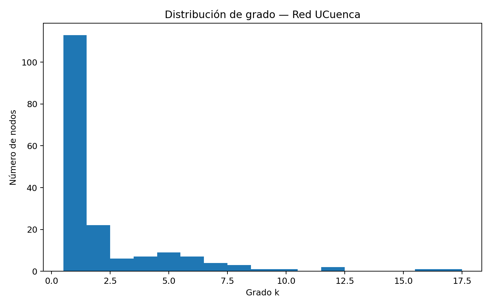

El enunciado exige no afirmar "red libre de escala" solo por la apariencia visual del gráfico log-log, sino aplicar una prueba estadística. Se implementó el método de **Clauset, Shalizi & Newman (2009)**: estimación de máxima verosimilitud (MLE) discreta del exponente α, selección de *x*mín minimizando la distancia de Kolmogorov–Smirnov (KS), prueba de bondad de ajuste por *bootstrap* semi-paramétrico (1000 réplicas) y comparación contra una alternativa exponencial/geométrica mediante AIC (script `01_p1_caracterizacion.py`, tabla `11_prueba_ley_potencia.csv`).

**Tabla 2.** Resultado de la prueba de ley de potencia sobre la distribución de grado.

| Cantidad | Resultado |
|---|---:|
| *x*mín óptimo | 4 |
| α (MLE) | 2.737 |
| Nodos en la cola (grado ≥ *x*mín) | 36 de 177 |
| Décadas de grado cubiertas | 0.63 |
| Distancia KS observada | 0.167 |
| *p*-valor *bootstrap* (bondad de ajuste) | 0.354 |
| AIC ley de potencia vs. exponencial | 164.8 vs. **158.6** |

**Figura 2.** Distribución de grado en escala log-log con ajuste de ley de potencia superpuesto.
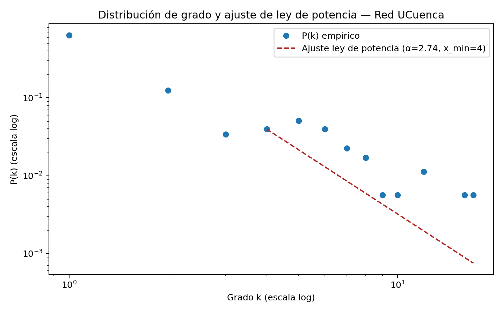

**Conclusión: no hay evidencia suficiente para calificar a la red UCuenca como "libre de escala".** El exponente ajustado (α ≈ 2.74) cae dentro del rango típico de redes libres de escala (2 < α < 3) y el *p*-valor de bondad de ajuste (0.354 > 0.1) no permite *rechazar* la ley de potencia por sí sola; sin embargo, el ajuste cubre menos de una década de grados (de 4 a 17, con solo 36 nodos en la cola) y el criterio de información AIC prefiere la alternativa exponencial. Con 177 nodos y grado máximo 17 no existen suficientes grados de libertad para distinguir estadísticamente una ley de potencia de una cola exponencial. La lectura correcta no es "libre de escala", sino **"cola de grado más pesada que una red aleatoria comparable"** (cuantificado en la sección 2.2 frente a Erdős–Rényi), coherente con la existencia de unos pocos concentradores de *core*/agregación, pero sin base estadística para la etiqueta más fuerte.

#### 2.1.3 Centralidades

Se calcularon las centralidades de grado, intermediación (*betweenness*), cercanía (*closeness*) y vector propio (*eigenvector*) para los 177 nodos (`02_centralidades_todos.csv`). La Tabla 3 compara el top-10 de cada una.

**Tabla 3.** Top-10 comparativo de las cuatro centralidades.

| # | Grado (nodo, campus) | Intermediación (nodo, campus) | Cercanía (nodo, campus) | Vector propio (nodo, campus) |
|---:|---|---|---|---|
| 1 | DATCC-2A-C3 (Central) — 0.0966 | DATCC-2A-C3 (Central) — 0.4468 | INTERNET-MPLS (MPLS) — 0.2759 | DATCC-2A-C3 (Central) — 0.5022 |
| 2 | DATCC-2A-C2 (Central) — 0.0909 | CPAR-C10 (Paraíso) — 0.4043 | DATCC-2A-C3 (Central) — 0.2683 | DATCC-2A-C2 (Central) — 0.4818 |
| 3 | AGRPRI-1A-D10 (Yanuncay) — 0.0682 | ROUTER-CAMPUS-HUAYNA-CAPAC (Paraíso) — 0.3663 | PE2-CENTRAL (Central) — 0.2667 | FORTIGATE-1800F-CENTRAL (Central) — 0.2005 |
| 4 | BAL-AUL2-D1 (Balzay) — 0.0682 | INTERNET-MPLS (MPLS) — 0.3657 | FORTIGATE-1800F-CENTRAL (Central) — 0.2596 | CC-ARQUITECTURA-D107 (Central) — 0.1977 |
| 5 | CC-ARQUITECTURA-D107 (Central) — 0.0568 | PE2-CENTRAL (Central) — 0.2881 | PE1-CENTRAL (Central) — 0.2562 | CC-MONJAS-D126 (Central) — 0.1855 |
| 6 | CP-EADMINA1-D6 (Paraíso) — 0.0511 | DT-0A-C13 (Balzay) — 0.2235 | PE1-BALZAY (Balzay) — 0.2511 | CC-ADM-D40 (Central) — 0.1799 |
| 7 | CC-MONJAS-D126 (Central) — 0.0455 | FORTIGATE-1800F-CENTRAL (Central) — 0.1863 | DATCC-2A-C2 (Central) — 0.2475 | CC-ECONOMIA-D51 (Central) — 0.1751 |
| 8 | DT-0A-C13 (Balzay) — 0.0455 | DATCC-2A-C2 (Central) — 0.1706 | ROUTER-CAMPUS-HUAYNA-CAPAC (Paraíso) — 0.2421 | CC-JURISPRUDENCIA-D110 (Central) — 0.1748 |
| 9 | INTERNET-MPLS (MPLS) — 0.0455 | FORTIGATE-1800F-BALZAY (Balzay) — 0.1490 | FORTIGATE-1800F-BALZAY (Balzay) — 0.2408 | CC-FILOSOFIA-A-D108 (Central) — 0.1701 |
| 10 | BAL-CENTEC-D2 (Balzay) — 0.0398 | PE2-BALZAY (Balzay) — 0.1460 | PE2-BALZAY (Balzay) — 0.2385 | CC-QUIMICA-D109 (Central) — 0.1701 |

**Grado e intermediación coinciden solo parcialmente.** De los diez primeros de cada ranking, cinco aparecen en ambos: `DATCC-2A-C3`, `DATCC-2A-C2`, `CPAR-C10`, `DT-0A-C13` e `INTERNET-MPLS`. El caso más revelador es `ROUTER-CAMPUS-HUAYNA-CAPAC`: con grado 3 (fuera del top-10 por grado) alcanza la tercera intermediación más alta de toda la red (0.366). El grado mide conectividad **local** —por eso domina en dispositivos de agregación que concentran muchos enlaces directos, como `AGRPRI-1A-D10` o `BAL-AUL2-D1`—, mientras que la intermediación mide participación en caminos **globales** —por eso domina en routers WAN, *firewalls* de interconexión y el nodo MPLS, que actúan como corredores obligatorios entre regiones enteras de la infraestructura aunque tengan pocos vecinos directos—. La implicación de ingeniería es directa: **un nodo con muchas conexiones no es necesariamente el más crítico para mantener comunicada la red**; los de alto grado son concentradores locales, los de alta intermediación son puertas de enlace cuya falla puede incomunicar regiones completas. Esta distinción se retoma cuantitativamente en la Fase 4 (percolación dirigida, P8) y en el índice compuesto de criticidad (P10).

#### 2.1.4 *Clustering*, diámetro, distancia media y asortatividad

**¿Por qué el *clustering* medio (0.0343) es tan bajo comparado con una red social?** En una red social, si *A* conoce a *B* y a *C*, es frecuente que *B* y *C* también se conozcan, generando muchos triángulos. En una red de datos jerárquica no existe una razón funcional equivalente: un equipo de acceso se conecta hacia un equipo de agregación y este hacia el *core*, pero no hay necesidad operativa de que dos equipos de acceso del mismo bloque estén conectados entre sí —hacerlo añadiría puertos, cableado y costo sin beneficio—. La arquitectura *core → agregación → acceso* favorece estructuras tipo árbol/estrella, con pocos triángulos por construcción. Un *clustering* bajo no implica ausencia de redundancia: esta puede concentrarse en enlaces alternativos puntuales sin formar triángulos en el resto de la red.

**¿Por qué la asortatividad es negativa (−0.1468) y qué dice sobre la jerarquía?** Una asortatividad negativa indica que los nodos de grado alto tienden a conectarse con nodos de grado bajo. Los equipos *core* (`DATCC-2A-C3`, grado 17; `DATCC-2A-C2`, grado 16) y de agregación (`AGRPRI-1A-D10`, `BAL-AUL2-D1`, grado 12) concentran conexiones hacia numerosos equipos periféricos de grado bajo. Esto es exactamente lo esperable de una jerarquía *core–agregación–acceso*: es evidencia estructural de jerarquía, no de una red donde los concentradores se enlazan principalmente entre sí. La magnitud (−0.15) corresponde a una tendencia disasortativa moderada, no extrema.

El diámetro (11 saltos) y la distancia media (5.83 saltos) son relativamente altos para una red de 177 nodos, reflejo directo de la ausencia de atajos entre ramas distintas del árbol jerárquico: para comunicar dos equipos de acceso de campus diferentes casi siempre hay que subir hasta el *core*/MPLS y volver a bajar.

#### 2.1.5 Puntos de articulación y puentes

**Tabla 4.** Puentes por campus (o par de campus, si el puente es intercampus).

| Campus | Puentes |
|---|---:|
| Campus Central | 56 |
| Campus Paraíso | 42 |
| Campus Balzay | 25 |
| Campus Yanuncay | 12 |
| Campus Hospitalidad | 4 |
| Campus Central ↔ Nube MPLS | 1 |
| Campus Hospitalidad ↔ Nube MPLS | 1 |

**Tabla 5.** Puentes por par de capas.

| Par de capas | Puentes |
|---|---:|
| acceso ↔ agregación | 111 |
| acceso ↔ acceso | 19 |
| agregación ↔ core | 6 |
| agregación ↔ wan | 3 |
| agregación ↔ agregación | 1 |
| core ↔ wan | 1 |

**Tabla 6.** Puntos de articulación por campus y capa (top categorías).

| Campus | Capa | Cantidad |
|---|---|---:|
| Campus Central | agregación | 13 |
| Campus Central | acceso | 10 |
| Campus Paraíso | acceso | 6 |
| Campus Paraíso | agregación | 6 |
| Campus Balzay | agregación | 5 |
| Campus Balzay | acceso | 1 |
| Campus Hospitalidad | agregación | 1 |
| Campus Paraíso | core | 1 |
| Campus Paraíso | wan | 1 |
| Campus Yanuncay | agregación | 1 |
| Campus Yanuncay | wan | 1 |
| Nube MPLS | wan | 1 |

*(Listado completo de 47 puntos de articulación y 141 puentes en `resultados/tablas/04_puntos_articulacion.csv` y `06_puentes.csv`, referenciado en Anexos.)*

El patrón dominante (111 de 141 puentes, 79 %) es el tramo **acceso↔agregación**: la inmensa mayoría de los equipos de acceso cuelga de un único switch de agregación sin ruta alternativa. Esto es consistente con el diseño declarado en el informe técnico —la redundancia se reserva para los tramos troncales, no para el "último salto" hacia el usuario final—.

#### 2.1.6 Contraste con lo declarado por el informe técnico

El informe técnico afirma que Balzay y Paraíso implementan redundancia física completa entre *core* y agregación, mientras que Campus Central dispone de enlaces simples entre agregación y acceso. La Tabla 7 contrasta esa afirmación usando el atributo `capa`.

**Tabla 7.** Contraste de redundancia *core*–agregación por campus (`09_contraste_core_agregacion.csv`).

| Campus | Nodos *core* | Nodos agregación | Enlaces *core*-agregación | Ciclos en el subgrafo | Puentes en el subgrafo |
|---|---:|---:|---:|---:|---:|
| Campus Balzay | 2 | 5 | 8 | 4 | 1 |
| Campus Paraíso | 1 | 6 | 6 | 0 | 6 |
| Campus Central | 2 | 14 | 26 | 13 | 0 |

Los resultados son parcialmente coherentes con el informe técnico y matizan uno de sus supuestos:

- **Balzay** muestra 4 ciclos en el subgrafo *core*-agregación, confirmando redundancia real: existen rutas alternativas entre el núcleo y varios equipos de agregación. Aun así, queda 1 puente residual, es decir, la redundancia no cubre el 100 % de las conexiones de esa capa.
- **Paraíso**, en cambio, **no presenta ciclos** en este subgrafo (0) y sus 6 enlaces *core*-agregación son puentes en su totalidad: al nivel de este grafo simplificado, **no se observa la redundancia física que el informe técnico declara para Paraíso**. Esto puede deberse a que la redundancia real (enlaces agrupados/*LAG*, o miembros secundarios con `rol=respaldo`) se colapsó en una sola arista durante el saneado del grafo, o a que la redundancia de Paraíso opera a un nivel distinto del modelado aquí (p. ej., electrónica activa-pasiva sin una segunda ruta topológica). Es un hallazgo que amerita señalarse como limitación del modelo (retomado en la Fase 5).
- **Campus Central** exhibe 13 ciclos y **cero puentes** en su subgrafo *core*-agregación, es decir, la mayor redundancia de los tres campus en ese tramo —contrario a lo que sugeriría una lectura superficial del informe técnico, que solo menciona explícitamente la ausencia de redundancia agregación-acceso en Central (no *core*-agregación—. El hallazgo no contradice al informe: la ausencia de redundancia que este declara para Central es específicamente en el tramo agregación→acceso, no en *core*→agregación, y los datos lo confirman en ambos sentidos.

### 2.2 P2 — Modelos nulos y visualización

#### 2.2.1 Comparación con Erdős–Rényi y modelo de configuración

Se generaron 100 realizaciones de un grafo aleatorio de Erdős–Rényi *G*(*n*,*m*) con *n*=177, *m*=209, y 100 realizaciones de un modelo de configuración que preserva exactamente la secuencia de grados observada (mediante *double-edge-swap*, 10·*E* intercambios). La Tabla 8 compara clustering, distancia media, diámetro y asortatividad de la red real frente a la media ± desviación estándar de cada modelo, con el *z*-score de la red real respecto a cada distribución nula.

**Tabla 8.** Red real frente a modelos nulos (`04_comparacion_red_real_vs_nulos.csv`).

| Métrica | Red real | Erdős–Rényi (media ± sd) | *z* vs. ER | Configuración (media ± sd) | *z* vs. Config. |
|---|---:|---:|---:|---:|---:|
| Clustering | 0.0343 | 0.0087 ± 0.0070 | **+3.66** | 0.0169 ± 0.0068 | **+2.55** |
| Distancia media (CG) | 5.830 | 5.577 ± 0.212 | +1.19 | 4.138 ± 0.121 | **+13.95** |
| Diámetro (CG) | 11.0 | 13.17 ± 1.33 | −1.63 | 9.09 ± 0.98 | **+1.96** |
| Asortatividad | −0.1468 | −0.0048 ± 0.0664 | **−2.14** | −0.0710 ± 0.0632 | −1.20 |

**Figuras 3–6.** Comparación (diagramas de caja) de clustering, distancia media, diámetro y asortatividad — red real vs. modelos nulos.

| 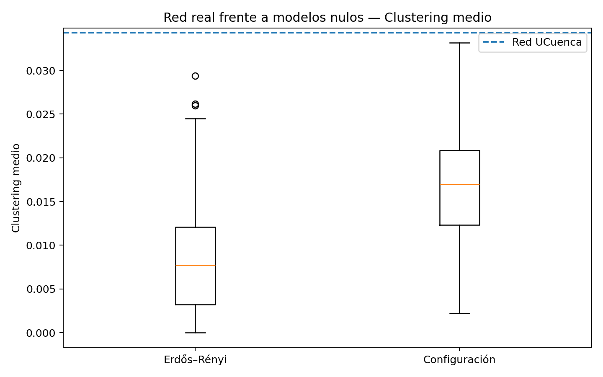 | 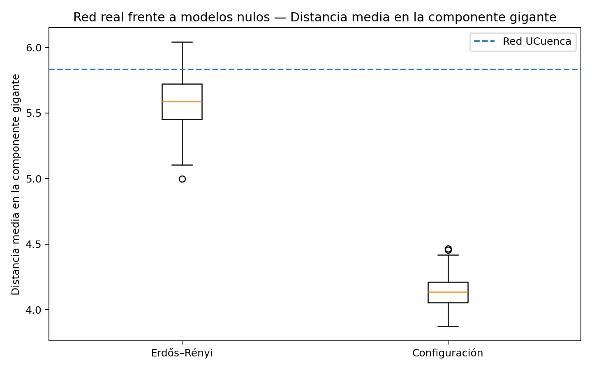 |
|---|---|
| 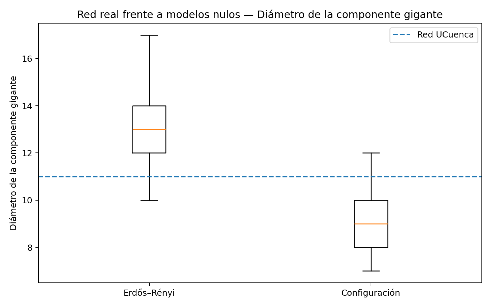 | 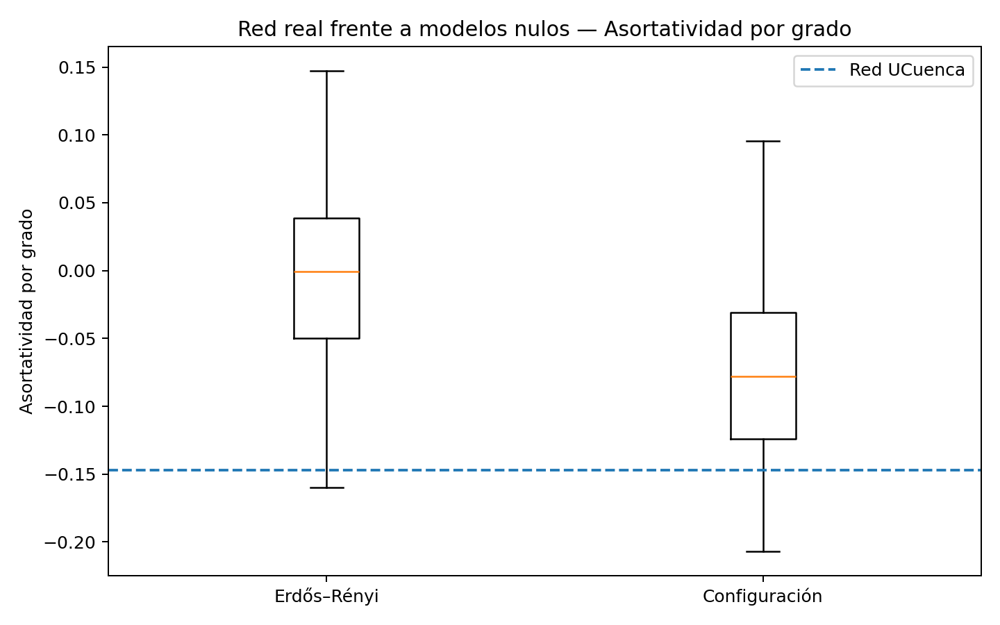 |

**Qué propiedades explica la secuencia de grados y cuáles no.** El clustering real (0.0343) es significativamente mayor que en ambos modelos nulos (*z* > 2.5 en ambos casos), incluido el modelo de configuración que ya preserva la secuencia de grados exacta: esto indica que la organización topológica de la red —no solo cuántos vecinos tiene cada nodo— favorece activamente algo más de agrupamiento local que el puramente aleatorio, aunque en términos absolutos siga siendo bajo. La asortatividad real es más negativa que en ambos nulos (*z* = −2.14 frente a ER), es decir, **la jerarquía disasortativa observada no se explica solo por tener unos pocos nodos de grado alto**: el modelo de configuración, que mezcla aleatoriamente las conexiones conservando el mismo grado por nodo, produce una asortatividad promedio de −0.071, menos negativa que la real (−0.1468); la diferencia refleja que el diseño jerárquico deliberado (core→agregación→acceso) impone una correlación de grado más fuerte que la que produciría el azar con la misma secuencia de grados.

La distancia media real (5.83) es más de 13 desviaciones estándar por encima de la del modelo de configuración (4.14): al mezclar aleatoriamente las conexiones se generan atajos entre ramas del árbol que en la topología real no existen, porque la jerarquía obliga a subir hasta el *core* para cruzar de una rama a otra. Un hallazgo adicional relevante para la Fase 4 (percolación): la fracción de nodos en la componente gigante y el número de componentes de las 100 realizaciones nulas (`03_resumen_modelos_nulos.csv`) muestran que, en promedio, ni Erdős–Rényi (87.6 % ± 2.4 %, 19.4 ± 2.9 componentes) ni el modelo de configuración (80.4 % ± 3.7 %, 17.2 ± 2.9 componentes) permanecen conectados como una sola pieza —el grado medio real (2.36) está por debajo del umbral teórico de conectividad de Erdős–Rényi (⟨k⟩ ≈ ln *n* ≈ 5.18)—. La red UCuenca real, en cambio, es una única componente conexa por diseño: es un recordatorio de que esta es una red **construida deliberadamente para estar conectada**, no una realización aleatoria, y de que los modelos nulos aleatorios subestiman sistemáticamente su conectividad.

#### 2.2.2 Comparación con Barabási–Albert

Se generó una red de Barabási–Albert con *n*=177 y *m*BA=1 (176 aristas, el valor entero estándar más cercano a las 209 aristas reales sin duplicar el orden de magnitud de enlaces).

**Tabla 9.** Red real frente a Barabási–Albert (`05_barabasi_albert.csv`).

| Métrica | Red real | Barabási–Albert (*m*=1) |
|---|---:|---:|
| Aristas | 209 | 176 |
| Clustering | 0.0343 | 0.0000 |
| Distancia media | 5.830 | 6.287 |
| Diámetro | 11 | 14 |
| Asortatividad | −0.1468 | −0.2714 |

Una red de infraestructura física **no** se parece a un modelo de crecimiento por conexión preferencial, y los datos lo confirman en dos frentes. Primero, BA con *m*=1 es por construcción un árbol (clustering exactamente 0), mientras que la red real, aunque también dispersa, sí exhibe algo de agrupamiento local (0.0343) proveniente de la redundancia deliberada en Balzay y Central. Segundo, y más importante conceptualmente: la conexión preferencial supone que cada nodo nuevo se une probabilísticamente a los nodos ya populares, un mecanismo de crecimiento orgánico y sin planificación central. La red UCuenca, en cambio, se construye top-down: existe un número fijo y predeterminado de equipos *core* (5) y de agregación (27) definidos por el diseño de la institución, y cada equipo de acceso nuevo se conecta al punto de agregación de *su edificio*, no al equipo más conectado de toda la red. Esto explica por qué la asortatividad de BA (−0.27) es más extrema que la real (−0.15): la conexión preferencial concentra aún más el grado en unos pocos hubs que el diseño jerárquico planificado de la universidad.

#### 2.2.3 Visualizaciones propias

**Figura 7.** Red UCuenca coloreada por campus. *Layout*: `spring_layout` (algoritmo de Fruchterman-Reingold) con semilla fija (2026) y parámetro `k=0.42` ajustado para separar visualmente los clústeres de campus sin que se sobrepongan los nodos de grado bajo; es el *layout* estándar de `networkx` más adecuado para grafos dispersos y jerárquicos como este, al converger hacia una disposición donde los nodos muy conectados quedan naturalmente al centro.

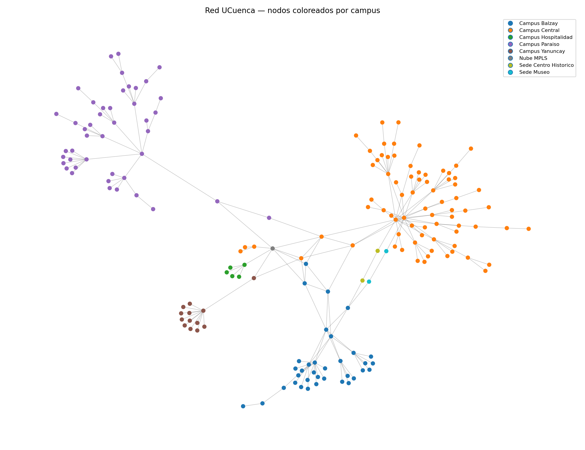

**Figura 8.** Red UCuenca con tamaño de nodo proporcional a la centralidad de intermediación (mismo *layout* que la Figura 7, para comparabilidad visual directa).

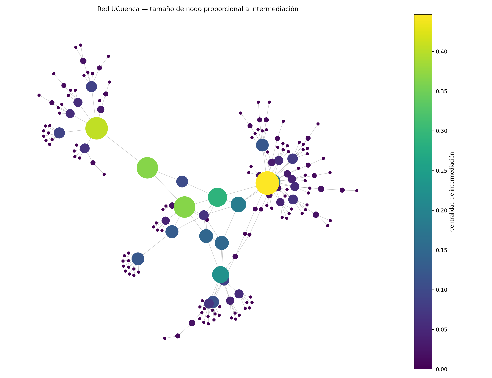

La comparación visual entre ambas figuras refuerza el hallazgo cuantitativo de la sección 2.1.3: los nodos más grandes en la Figura 8 (mayor intermediación) no son necesariamente los de mayor grado visual en la Figura 7, sino los que ocupan posiciones "de paso" entre agrupaciones de campus —confirmando visualmente que grado e intermediación capturan roles estructurales distintos.

### 2.3 Síntesis de la Fase 1

La red UCuenca es una infraestructura dispersa (densidad 1.34 %), jerárquica (asortatividad negativa, *clustering* bajo) y con redundancia concentrada en tramos específicos: 141 de 209 aristas (67.5 %) son puentes, y el patrón dominante de puente es el tramo acceso↔agregación (79 % de los puentes). La comparación con el informe técnico confirma redundancia real en Balzay y, sorprendentemente, en el subgrafo *core*-agregación de Campus Central, pero **no la confirma en Paraíso** al nivel de este grafo simplificado —una discrepancia documentada que debe tenerse en cuenta al interpretar resultados posteriores de flujo máximo y percolación en ese campus—. Estadísticamente, no puede afirmarse que la red sea "libre de escala" (rango de grados insuficiente, AIC favorece una alternativa exponencial), aunque sí exhibe más *clustering* y más disasortatividad de las que explicaría el azar puro dada su secuencia de grados, y es notablemente más robusta en conectividad global que cualquier red aleatoria comparable —consistente con tratarse de una topología deliberadamente diseñada, no crecida orgánicamente—. Los nodos de mayor intermediación (`DATCC-2A-C3`, `CPAR-C10`, `ROUTER-CAMPUS-HUAYNA-CAPAC`, `INTERNET-MPLS`) son los primeros candidatos a puntos críticos, y se retoman cuantitativamente en las Fases 3 y 4.

---

## 3. Fase 2 — Recorrido y partición (P3–P4)

*Unidad 2 del sílabo. Scripts: `scripts/03_p3_bfs_dfs.py`, `scripts/04_p4_comunidades.py`. Resultados en `resultados/tablas/perfil_BFS_*.csv`, `01…12_*.csv` y `resultados/figuras/`.*

### 3.1 P3 — BFS y DFS sobre la red

#### 3.1.1 Implementación y complejidad

BFS y DFS se implementaron **desde cero**, sin usar las funciones de recorrido de NetworkX; estas se emplean únicamente para verificar el resultado (`assert distancia == dist_nx`, `assert len(nx.cycle_basis(G)) == len(ciclos)`).

- **BFS** (`bfs_desde_cero`): cola FIFO (`collections.deque`), un conjunto de visitados, y diccionarios `padre`/`distancia` construidos durante el recorrido. Complejidad **O(V+E)** en tiempo y **O(V)** en memoria — estándar para lista de adyacencia.
- **DFS** (`dfs_ciclos_desde_cero`): pila explícita de pares (nodo, iterador de vecinos) en lugar de recursión, para evitar el límite de profundidad de recursión de Python en un grafo de 177 nodos; diccionarios `padre`/`profundidad`. Un ciclo fundamental se detecta cuando, durante el recorrido, aparece una arista hacia un nodo ya visitado que **no** es el padre directo y que tiene menor profundidad (arista *back* hacia un ancestro). Complejidad de recorrido **O(V+E)**; la reconstrucción explícita de cada ciclo añade un costo proporcional a su longitud. Como verificación estructural, el número de ciclos encontrados coincide exactamente con el rango ciclomático **E − V + 1 = 209 − 177 + 1 = 33**.

#### 3.1.2 Perfil de profundidad desde el *core* de Campus Central

BFS desde `DATCC-2A-C3` (switch de *core* de Campus Central) produce el siguiente perfil de profundidad:

**Tabla 10.** Perfil de profundidad BFS desde `DATCC-2A-C3` (`perfil_BFS_DATCC-2A-C3.csv`).

| Distancia (saltos) | 0 | 1 | 2 | 3 | 4 | 5 | 6 | 7 |
|---|---:|---:|---:|---:|---:|---:|---:|---:|
| Nodos | 1 | 17 | 50 | 19 | 13 | 40 | 29 | 8 |

A escala de **toda la red**, este perfil no refleja una jerarquía limpia de tres niveles: hay nodos de capa `acceso` en prácticamente todas las distancias (1 a 7) y nodos `agregación` entre las distancias 1 y 5 (`02_perfil_core_por_capa_toda_red.csv`), porque el BFS desde el *core* de Central atraviesa también los *cores* de los demás campus vía WAN/MPLS y continúa bajando por sus propias capas de agregación y acceso. La jerarquía sí se observa con nitidez cuando se restringe el perfil al propio **Campus Central**:

**Tabla 11.** Perfil de profundidad por capa, restringido a Campus Central (`03_perfil_core_por_capa_campus_central.csv`).

| Distancia | acceso | agregación | core | interconexión | wan |
|---:|---:|---:|---:|---:|---:|
| 0 | 0 | 0 | 1 | 0 | 0 |
| 1 | 0 | 13 | 1 | 1 | 1 |
| 2 | 43 | 0 | 0 | 0 | 1 |
| 3 | 10 | 1 | 0 | 0 | 0 |
| 4 | 3 | 0 | 0 | 0 | 0 |

Dentro de Central, el patrón es el esperado: el *core* está a distancia 0, la capa de agregación (junto con el *core* secundario, el *firewall* de interconexión y el enlace WAN) queda a distancia 1, y el grueso de los equipos de acceso (43 de los 56 equipos de acceso del campus, ≈77 %) queda a distancia 2 — es decir, **la jerarquía declarada por el informe técnico sí se refleja en las distancias medidas dentro de un mismo campus**. Sin embargo, no todos los equipos de acceso están exactamente a dos saltos: 10 quedan a distancia 3 y 3 a distancia 4, evidencia de que algunos tramos de acceso pasan por un conmutador intermedio adicional no documentado como capa propia, una desviación menor pero real respecto al modelo de tres capas puras.

#### 3.1.3 Perfil de profundidad desde la nube MPLS

**Tabla 12.** Perfil de profundidad BFS desde `INTERNET-MPLS` (`perfil_BFS_INTERNET-MPLS.csv`).

| Distancia (saltos) | 0 | 1 | 2 | 3 | 4 | 5 | 6 |
|---|---:|---:|---:|---:|---:|---:|---:|
| Nodos | 1 | 8 | 13 | 38 | 97 | 18 | 2 |

**Figura 9.** Perfiles de profundidad BFS: *core* de Campus Central vs. nube MPLS.
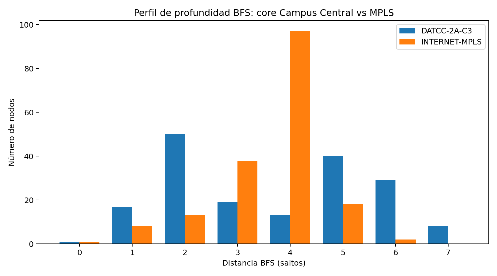

La mayoría de los equipos (97 de 177, el 55 %) se encuentra exactamente a 4 saltos de la nube MPLS, reflejo de que el camino típico equipo-de-acceso → agregación → *core* de campus → MPLS tiene longitud 4 en la mayor parte de la institución.

**Tabla 13.** Distancia media desde `INTERNET-MPLS` por campus/sede, ordenada de mayor a menor (`05_distancia_MPLS_por_campus.csv`).

| Campus / sede | Nodos | Distancia media | Mediana | Mín. | Máx. |
|---|---:|---:|---:|---:|---:|
| Sede Museo | 2 | 4.00 | 4.0 | 4 | 4 |
| Campus Paraíso | 44 | 3.86 | 4.0 | 1 | 5 |
| Campus Central | 75 | 3.75 | 4.0 | 1 | 6 |
| Campus Balzay | 35 | 3.63 | 4.0 | 1 | 6 |
| Sede Centro Histórico | 2 | 3.50 | 3.5 | 3 | 4 |
| Campus Yanuncay | 13 | 2.77 | 3.0 | 1 | 3 |
| Campus Hospitalidad | 5 | 1.80 | 2.0 | 1 | 2 |

**Figura 10.** Distancia media a la nube MPLS por campus/sede.
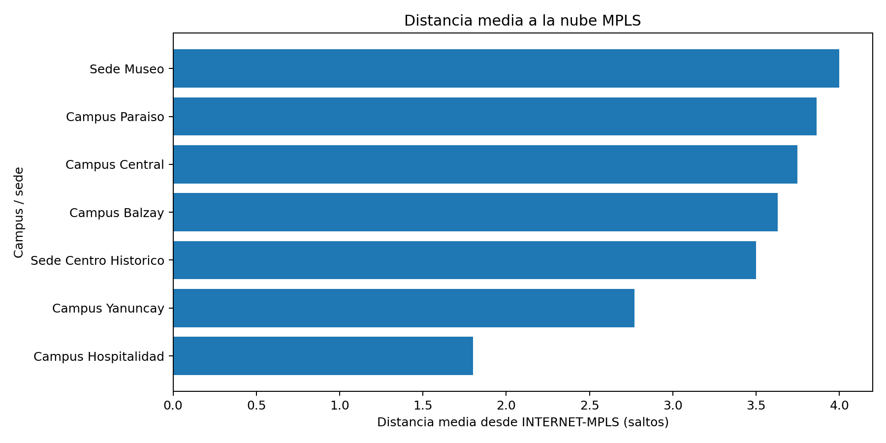

**Los campus que quedan más "lejos" de la institución en términos de saltos son Sede Museo (4.00) y Campus Paraíso (3.86)**, seguidos de cerca por Campus Central y Balzay (~3.7). **Campus Hospitalidad es, con diferencia, el más "cercano"** (1.80): tiene solo 5 nodos y, según se documentó en la Fase 1 (Tabla 4), es uno de los dos únicos campus con un puente **directo** hacia la nube MPLS (`Campus Hospitalidad ↔ Nube MPLS`), sin pasar por un *core* propio de campus. Este resultado de P3 confirma, desde un ángulo distinto (perfil de profundidad), el mismo hallazgo estructural detectado en P1 con puentes: Hospitalidad es un anexo pequeño y topológicamente plano, no un campus con jerarquía completa de tres capas.

#### 3.1.4 Ciclos detectados por DFS y su relación con la redundancia

**Tabla 14.** Ciclos fundamentales por zona (`08_resumen_ciclos_por_zona.csv`).

| Zona | Ciclos fundamentales | Longitud media | Longitud máxima |
|---|---:|---:|---:|
| Campus Central | 14 | 3.93 | 4 |
| Intercampus / WAN | 12 | 8.00 | 13 |
| Campus Balzay | 7 | 4.00 | 5 |

**Figura 11.** Ubicación de los 33 ciclos fundamentales detectados por DFS.
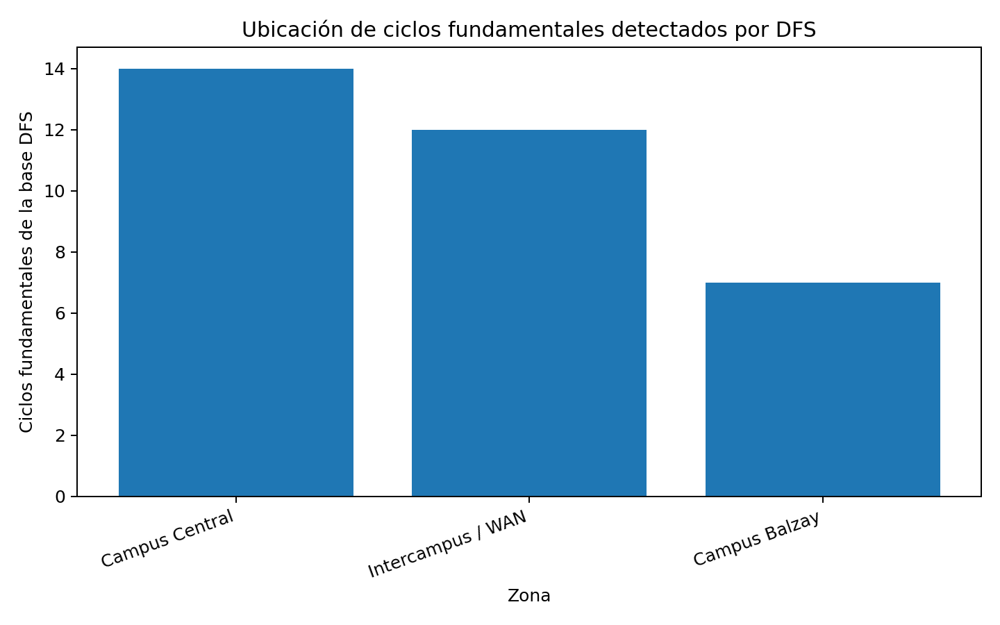

Los 33 ciclos fundamentales (= rango ciclomático *E*−*V*+1) se concentran en solo tres zonas: **Campus Central (14), la interconexión Intercampus/WAN (12) y Campus Balzay (7)**. **Ningún ciclo fundamental cae dentro de Paraíso, Yanuncay, Hospitalidad, Sede Museo o Sede Centro Histórico considerados de forma aislada**: en esos campus, la ausencia de ciclos equivale exactamente a la ausencia de camino alternativo que señala el enunciado, es decir, cualquier corte de un enlace interno a esos campus desconecta esa parte de la red sin que exista una ruta de respaldo *dentro del propio campus*. Esto reafirma, con una técnica distinta (DFS/ciclos fundamentales en vez de conteo de puentes por subgrafo), la discrepancia detectada en la sección 2.1.6 para Paraíso: el informe técnico declara redundancia física completa entre *core* y agregación en Paraíso, pero ni el conteo de puentes de P1 ni la localización de ciclos de P3 encuentran evidencia topológica de esa redundancia en el grafo reconstruido. Los ciclos de mayor longitud (media 8, máximo 13 saltos) están en la zona Intercampus/WAN, coherente con que la única redundancia de largo alcance de la red pasa por los enlaces duplicados hacia la nube MPLS.

#### 3.1.5 ¿BFS o DFS para un técnico que visita armarios físicamente?

El enunciado plantea la tarea de un técnico que debe visitar físicamente todos los armarios de un campus partiendo del *core*. **DFS modela mejor esta tarea que BFS.** Un recorrido BFS visita todos los nodos a distancia 1, después todos los de distancia 2, y así sucesivamente; trasladado a movimiento físico, eso obligaría al técnico a **regresar al *core* después de visitar cada nivel completo** antes de avanzar al siguiente, lo cual no corresponde a cómo se recorre físicamente un edificio. DFS, en cambio, avanza por una rama (p. ej., un pasillo o un bloque de aulas) hasta agotarla y solo retrocede al punto de bifurcación más cercano cuando no hay más equipos por visitar en esa rama —exactamente el patrón de una persona caminando por corredores y retrocediendo únicamente en los puntos sin salida—, minimizando el desplazamiento físico total. BFS sí es preferible para una tarea distinta: **priorizar qué equipos atender primero por cercanía topológica o urgencia** (por ejemplo, un diagnóstico remoto o una respuesta a incidentes donde conviene revisar primero los dispositivos a un salto del *core* antes que los más profundos), pero no para una visita exhaustiva y físicamente eficiente de todos los armarios.

### 3.2 P4 — Comunidades y modularidad

#### 3.2.1 Louvain con cinco semillas y estabilidad

Se aplicó Louvain (`networkx.community.louvain_communities`, adaptando la metodología de `intro/codes/gen_visualizacion-louvain.jl` del repositorio del módulo) sobre el grafo no ponderado, con cinco semillas distintas.

**Tabla 15.** Louvain con cinco semillas (`01_louvain_cinco_semillas.csv`).

| Semilla | Comunidades | Q | NMI vs. campus | ARI vs. campus |
|---:|---:|---:|---:|---:|
| 11 | 14 | 0.7587 | 0.6203 | 0.3385 |
| 22 | 13 | 0.7569 | 0.6339 | 0.3784 |
| 33 | **14** | **0.7632** | 0.6182 | 0.3265 |
| 44 | 16 | 0.7347 | 0.6449 | 0.3111 |
| 55 | 15 | 0.7592 | 0.6413 | 0.3477 |

La mayor modularidad se obtuvo con la semilla 33 (14 comunidades, *Q* = 0.7632), tomada como partición de referencia. El número de comunidades varía entre 13 y 16 y *Q* se mantiene en un rango estrecho (0.735–0.763), por lo que la **modularidad alcanzada es estable frente al cambio de semilla**, aunque la asignación exacta de algunos nodos individuales sí varía. Al comparar las cinco particiones entre sí por pares (`02_estabilidad_louvain.csv`), el NMI medio es **0.894** (mínimo 0.815) y el ARI medio **0.712** (mínimo 0.527): Louvain recupera una estructura macroscópica consistente, con cierta sensibilidad en los límites finos de algunas comunidades.

**Figura 12.** Estabilidad de Louvain: modularidad *Q* por semilla.
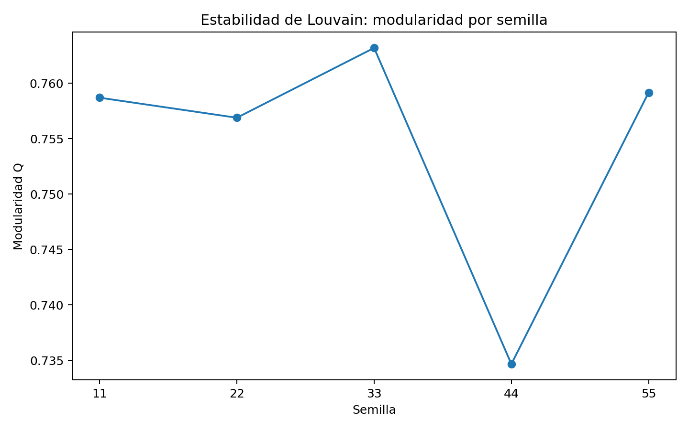

**Figura 13.** Red coloreada por comunidad Louvain (partición de referencia, semilla 33, *K*=14, *Q*=0.763).
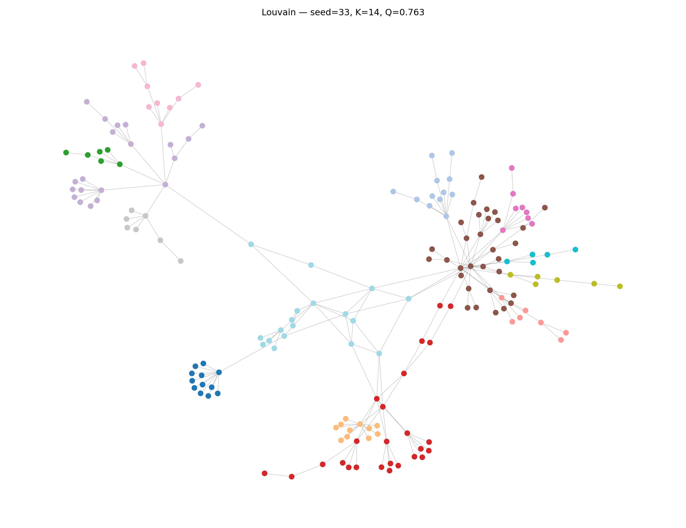

#### 3.2.2 Comparación con la partición natural por campus

**Tabla 16.** Comparación cuantitativa Louvain vs. partición por campus.

| Partición | Grupos | Q |
|---|---:|---:|
| Louvain (referencia) | 14 | **0.7632** |
| Campus | 8 | 0.6198 |
| Campus + capa | 24 | 0.0256 |

Frente a la partición por campus, Louvain obtiene NMI = 0.6182 y ARI = 0.3265 (`03_matriz_confusion_louvain_vs_campus.csv`): la coincidencia es **solo parcial**. Louvain alcanza además mayor modularidad que la partición geográfica pura (0.7632 frente a 0.6198), porque **subdivide los campus grandes en varios bloques estructurales**: Campus Central y Paraíso, en particular, se reparten en varias comunidades casi puras. Dos comunidades ilustran bien el fenómeno: la **comunidad 4** (25 nodos: 21 de Balzay, 2 de Sede Centro Histórico, 2 de Sede Museo) agrupa Balzay con las dos sedes pequeñas que dependen de él, mientras que la **comunidad 13** (18 nodos, seis ubicaciones distintas: Central, Hospitalidad, Balzay, Paraíso, Yanuncay y Nube MPLS) es una **comunidad funcional de interconexión/WAN**, no geográfica. (La partición "campus + capa", con 24 grupos, colapsa a *Q* ≈ 0.026 — casi nula—, evidencia de que subdividir además por capa dentro de cada campus no captura estructura real de conectividad: son demasiados grupos pequeños sin cohesión interna adicional.)

**Figura 14.** Matriz de confusión comunidad × campus.
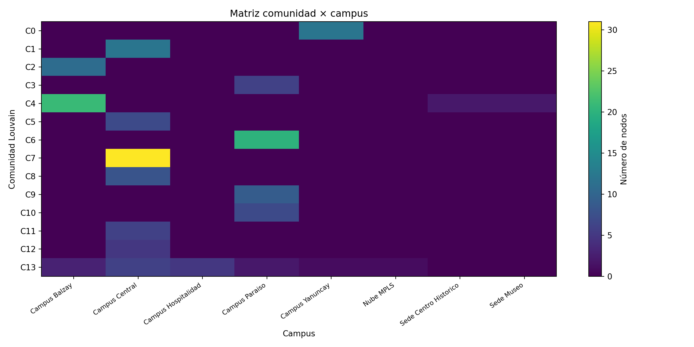

**Nodos donde discrepan las dos particiones.** Asignando a cada comunidad su campus dominante, 16 nodos quedan agrupados con un campus distinto al que pertenecen administrativamente (`05_nodos_discrepantes_campus_louvain.csv`): en su mayoría routers WAN, nodos PE, *firewalls* y equipos de interconexión (`INTERNET-MPLS`, `ROUTER-CAMPUS-HUAYNA-CAPAC`, `ROUTER-CAMPUS-PARAISO`, `ROUTER-CAMPUS-YANUNCAY`, `FORTIGATE-1800F-BALZAY`, `PE1-BALZAY`, `PE2-BALZAY`, entre otros), además de los cinco equipos de Hospitalidad (que Louvain agrupa con Central) y los equipos de las sedes Museo/Centro Histórico (agrupados con Balzay). **En términos de ingeniería, esta discrepancia no es un error de los datos: significa que la proximidad topológica de un equipo no siempre coincide con su ubicación administrativa.** Un router WAN físicamente instalado en Balzay puede estar, en términos de qué caminos mínimos lo atraviesan, más cerca funcionalmente de la interconexión central que de los propios equipos de acceso de su campus — el mismo fenómeno de "concentrador local vs. corredor global" ya observado con centralidad de grado vs. intermediación en la Fase 1.

#### 3.2.3 *K*-means sobre un embedding espectral

Para aplicar *k*-means a un grafo, cada nodo se representó como un vector mediante un **embedding espectral del laplaciano normalizado** *L* = *I* − *D*−1/2*AD*−1/2, tomando los primeros *K*=14 autovectores no triviales (igual al número de comunidades de Louvain, para comparación directa) y normalizando cada fila. El algoritmo de *k*-means se **implementó desde cero** en Python (inicialización *k*-means++, distancia euclídea al cuadrado, actualización por media, criterio de convergencia por desplazamiento de centroides), adaptando la estructura de `algoritmos/kmeans/ejemplo1.jl` del repositorio del módulo, y se ejecutó con las mismas cinco semillas, conservando la de menor WCSS.

**Tabla 17.** Mejor ejecución de *k*-means espectral (semilla 11) frente a Louvain.

| Métrica | Valor |
|---|---:|
| WCSS | 18.14 |
| Modularidad *Q* (k-means) | 0.7405 |
| NMI *k*-means vs. Louvain | 0.8748 |
| ARI *k*-means vs. Louvain | 0.6793 |
| NMI *k*-means vs. campus | 0.6327 |
| ARI *k*-means vs. campus | 0.3936 |

**Figura 15.** Red coloreada por clúster de *k*-means sobre el embedding espectral.
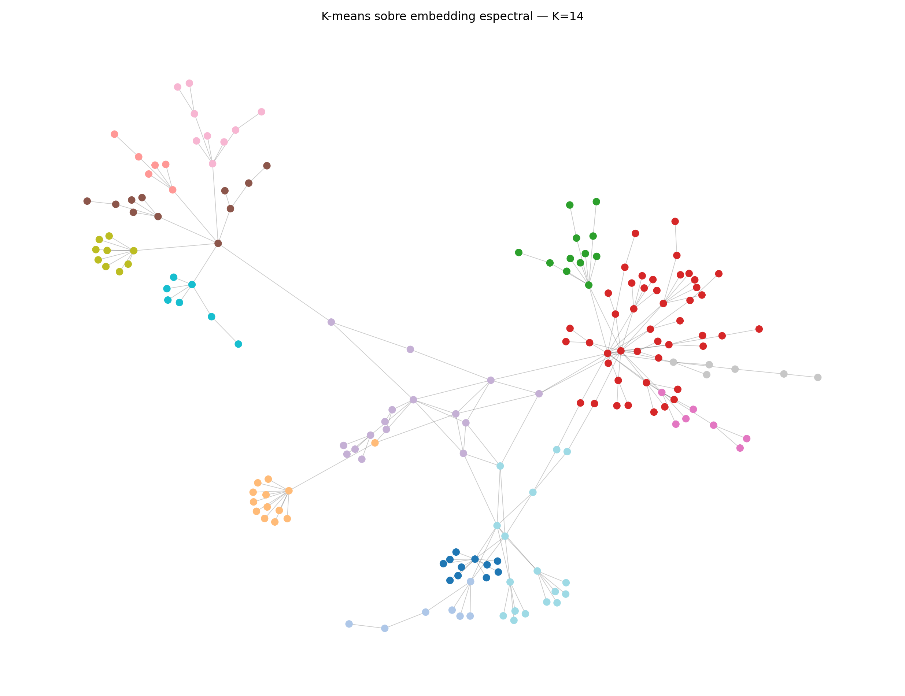

El resultado de *k*-means es cercano al de Louvain (NMI = 0.87) pero con modularidad menor (0.7405 frente a 0.7632), lo cual es esperable: Louvain optimiza directamente una función de las aristas del grafo, mientras que *k*-means minimiza distancias euclídeas en el espacio del embedding. **La distancia euclídea no siempre es adecuada para agrupar nodos de un grafo**: el espectro del laplaciano transforma la conectividad en coordenadas geométricas de forma aproximada, pero sigue asumiendo que las comunidades tienen forma aproximadamente esférica alrededor de un centroide y obliga a fijar *K* de antemano; una comunidad real de la red puede tener forma alargada o irregular, tamaños muy dispares, o estar delimitada por un cuello de botella topológico (un único enlace puente) que no se traduce con precisión en proximidad euclídea tras la proyección espectral.

#### 3.2.4 Limitación de resolución de la modularidad

**Tabla 18.** Sensibilidad de Louvain al parámetro de resolución γ (`10_sensibilidad_resolucion_louvain.csv`).

| γ | Comunidades | *Q* con γ | *Q* estándar (γ=1) de esa partición |
|---:|---:|---:|---:|
| 0.50 | 9 | 0.8199 | 0.7164 |
| 0.75 | 10 | 0.7919 | 0.7512 |
| 1.00 | 14 | 0.7632 | 0.7632 |
| 1.25 | 16 | 0.7358 | **0.7628** |
| 1.50 | 18 | 0.7140 | 0.7599 |
| 2.00 | 22 | 0.6826 | 0.7504 |

**Figura 16.** Número de comunidades en función del parámetro de resolución γ.
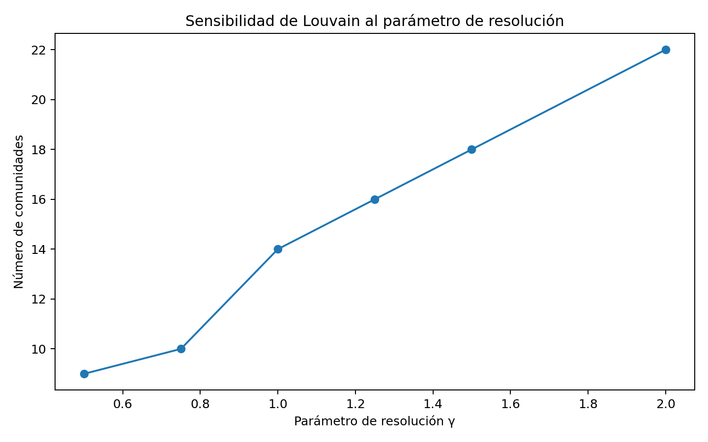

El hallazgo clave es que al pasar de γ=1 (14 comunidades) a γ=1.25 (**16** comunidades), la modularidad evaluada con el criterio estándar (γ=1) apenas cambia: de 0.76318 a 0.76277 — una partición sensiblemente más fina que es, en la práctica, casi tan buena como la "óptima" según *Q*. Al examinar el detalle (`11_evidencia_limitacion_resolucion.csv`), dos comunidades de γ=1 —una de 20 nodos y otra de 18— ya se subdividen en dos subgrupos al pasar a γ=1.25, y la fragmentación continúa a γ=1.5 y γ=2.0. **Esto es evidencia directa de la limitación de resolución de la modularidad**: no existe una única escala "correcta" de comunidades; Louvain a γ=1 puede estar fusionando bloques que un administrador de red consideraría unidades operativas distintas (por edificio, función, dominio de seguridad o gestión), simplemente porque fusionarlos incrementa *Q* lo suficiente para que el algoritmo no los separe a esa resolución. Las comunidades obtenidas deben leerse como una descripción de la organización de la conectividad **a una escala concreta**, no como una partición administrativa definitiva.

### 3.3 Síntesis de la Fase 2

BFS y DFS, implementados desde cero y verificados contra NetworkX, muestran que la jerarquía de tres capas declarada por el informe técnico **sí se cumple dentro de cada campus** (≈77 % de los equipos de acceso de Central están exactamente a 2 saltos del *core*), pero se diluye a escala de toda la red porque el camino entre campus obliga a atravesar la interconexión WAN/MPLS. El BFS desde la nube MPLS identifica a Paraíso y Sede Museo como los puntos más alejados de la institución (~3.9 saltos en promedio) y confirma, desde un ángulo distinto, la falta de redundancia interna de Paraíso ya señalada en la Fase 1: **ningún ciclo fundamental detectado por DFS cae dentro de ese campus**. Louvain revela una estructura comunitaria fuerte (*Q* ≈ 0.763) que coincide solo parcialmente con la división geográfica por campus (NMI = 0.62): los equipos de interconexión y WAN forman una comunidad funcional propia que atraviesa fronteras administrativas, el mismo patrón de "corredor global vs. concentrador local" detectado en la Fase 1. El análisis de resolución advierte que esa partición de 14 comunidades no es una escala privilegiada ni definitiva, sino una lectura entre varias igualmente plausibles según la modularidad.

## 4. Fase 3 — Optimización en redes (P5–P7)

*Unidad 3 del sílabo. Scripts: `scripts/05_p5_caminos.py`, `scripts/06_p6_flujo.py`, `scripts/07_p7_localizacion.py`. Resultados en `resultados/tablas/01…11_*.csv` (P5–P6, con prefijo propio por problema) y `resultados/figuras/`.*

### 4.1 P5 — Caminos más cortos

#### 4.1.1 Función de capacidad y modelos de peso

El conjunto de datos solo trae `capacidad_mbps` explícita en 28 de las 209 aristas (todas del diagrama MPLS). Para completar *c*(*u*,*v*) en los 181 enlaces restantes se adoptaron los siguientes supuestos, documentados en `01_modelo_pesos_y_capacidades.csv`/`02_supuestos_modelo_pesos.csv`: se conserva toda capacidad explícita; los enlaces troncales de *core*, WAN o interconexión y los de agregación-agregación se fijan en **10 Gbps** (el valor que el informe técnico declara para los troncales); los enlaces acceso-agregación y acceso-acceso se fijan en **1 Gbps**, a falta de dato nominal documentado. El tráfico (`trafico_mbps`) solo está definido en 170 de 209 aristas; para las 39 restantes se imputó la mediana de utilización observada (≈1.648 % de la capacidad) — una imputación que solo pretende completar la matriz para el modelo de carga y que se declara explícitamente como limitación del análisis (retomada en la sección 7).

Se evaluaron los tres modelos de peso del enunciado:

- **Saltos:** *w*(*u*,*v*) = 1.
- **Latencia/capacidad:** *w*(*u*,*v*) = α + β / *c*(*u*,*v*), con **α = 1.0** y **β = 1000 Mbps** — de modo que un enlace de 1 Gbps pesa 2.0, uno de 10 Gbps pesa 1.1 y uno de 20 Gbps pesa 1.05; α evita que enlazar muchos tramos de alta capacidad resulte artificialmente "gratis" y conserva un costo base por salto.
- **Carga:** *w*(*u*,*v*) = *b*(*u*,*v*) / *c*(*u*,*v*), la utilización relativa del enlace.

Con las capacidades adoptadas, **los tres modelos producen únicamente pesos no negativos**, por lo que Dijkstra es válido para los tres (no fue necesario recurrir a Bellman-Ford).

#### 4.1.2 Dijkstra y Floyd-Warshall: implementación, verificación y tiempos

Ambos algoritmos se implementaron **desde cero**. Dijkstra usa una cola de prioridad (`heapq`) con actualización de distancia provisional y predecesor por nodo — complejidad **O((V+E) log V)**. Floyd-Warshall mantiene una matriz *V*×*V* y prueba cada nodo como intermediario de cada par — complejidad **O(V³)** en tiempo y **O(V²)** en memoria.

Se verificaron **20 pares de nodos aleatorios bajo los tres modelos de peso (60 comparaciones en total)**: Dijkstra y Floyd-Warshall coincidieron en el 100 % de los casos (`03_verificacion_20_pares.csv`).

**Tabla 19.** Comparación empírica de tiempos sobre subredes de tamaño creciente (`04_benchmark_dijkstra_floyd.csv`), construidas por BFS desde el *core* de Central para mantenerlas conexas.

| *V* | *E* | Dijkstra, 1 fuente (ms) | Floyd-Warshall, todos los pares (ms) | Dijkstra desde todas las fuentes (ms) |
|---:|---:|---:|---:|---:|
| 25 | 39 | 0.038 | 0.544 | 0.879 |
| 50 | 64 | 0.072 | 2.935 | 3.668 |
| 75 | 93 | 0.093 | 7.965 | 7.270 |
| 100 | 132 | 0.136 | 15.205 | 13.201 |
| 125 | 157 | 0.163 | 25.753 | 20.555 |
| 150 | 182 | 0.197 | 35.422 | 29.438 |
| 177 | 209 | 0.224 | **54.571** | **40.367** |

**Figura 17.** Tiempos de ejecución de Dijkstra vs. Floyd-Warshall en función del tamaño de la subred.
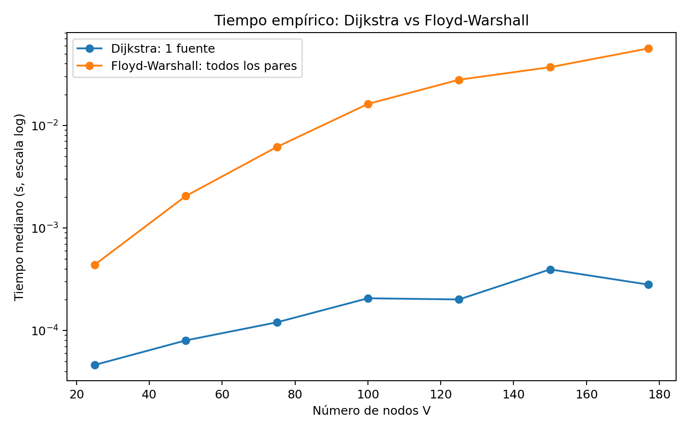

**Figura 18.** Comparación de tiempos para el cálculo de todos los pares: Dijkstra desde cada fuente vs. Floyd-Warshall.
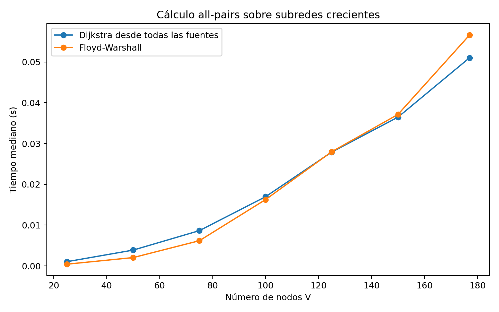

Sobre la red completa (177 nodos), Dijkstra desde una única fuente toma ≈0.224 ms frente a los ≈54.6 ms que Floyd-Warshall necesita para construir la matriz completa: para una **consulta individual**, Dijkstra es claramente preferible, coherente con la teoría (*O*((*V*+*E*)log *V*) ≪ *O*(*V*³) cuando *E* ≈ *V*, como ocurre en esta red muy dispersa). Para el cálculo de **todos los pares**, Floyd-Warshall es competitivo solo en las subredes pequeñas (25–50 nodos); a partir de ≈75 nodos, ejecutar Dijkstra desde cada una de las *V* fuentes resulta más rápido en conjunto que Floyd-Warshall, precisamente porque Dijkstra explota la dispersión de la red (pocas aristas por nodo) mientras Floyd-Warshall realiza trabajo cúbico sin importar cuántas aristas existan. Si cada consulta fuera un par independiente en lugar de todos los pares, Floyd-Warshall empezaría a amortizar su costo de preprocesamiento después de aproximadamente 381 pares consultados en la red completa.

#### 4.1.3 Ranking de cercanía y sensibilidad al modelo de peso

**Tabla 20.** Top-10 por cercanía ponderada [(*n*−1) / Σ*d*(*i*,*j*)] bajo los tres modelos de peso (`06_top10_cercania_tres_pesos.csv`).

| # | Saltos | Latencia | Carga |
|---:|---|---|---|
| 1 | `INTERNET-MPLS` | `INTERNET-MPLS` | `INTERNET-MPLS` |
| 2 | `DATCC-2A-C3` | `PE2-CENTRAL` | `CC-AETUC-D30` |
| 3 | `PE2-CENTRAL` | `DATCC-2A-C3` | `CC-ARQUITECTURA-D107` |
| 4 | `FORTIGATE-1800F-CENTRAL` | `PE1-CENTRAL` | `CC-BIBLIOTECA-D112` |
| 5 | `PE1-CENTRAL` | `PE1-BALZAY` | `CC-PROMAS-D31` |
| 6 | `PE1-BALZAY` | `FORTIGATE-1800F-CENTRAL` | `CC-QUIMICA-D109` |
| 7 | `DATCC-2A-C2` | `ROUTER-CAMPUS-HUAYNA-CAPAC` | `DATCC-2A-C3` |
| 8 | `ROUTER-CAMPUS-HUAYNA-CAPAC` | `DATCC-2A-C2` | `QUI-0A-A78` |
| 9 | `FORTIGATE-1800F-BALZAY` | `PE2-BALZAY` | `PE2-CENTRAL` |
| 10 | `PE2-BALZAY` | `ROUTER-CAMPUS-PARAISO` | `FORTIGATE-1800F-CENTRAL` |

**Figura 19.** Top-10 por cercanía bajo los tres modelos de peso.
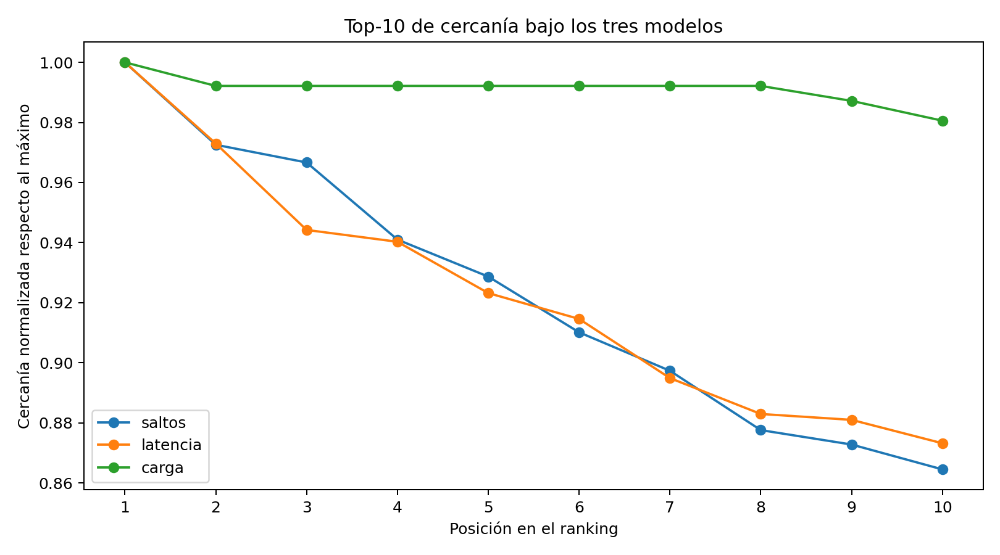

**El ranking sí cambia según qué se minimiza.** Saltos y latencia comparten 9 de sus 10 primeros nodos (la penalización base α=1 mantiene el costo por salto dominante mientras la mayoría de los troncales tiene capacidades comparables), pero el modelo de carga comparte solo 4 nodos con cada uno de los otros dos: al medir exclusivamente utilización (*b*/*c*), un enlace ocioso —aunque esté muchos saltos lejos o sea de baja capacidad— cuesta casi cero, por lo que aparecen en el top-10 varios equipos de agregación e incluso un nodo de acceso que no son centrales bajo ningún otro criterio. Esto confirma que "el nodo más central" depende de qué magnitud de ingeniería se decide minimizar: saltos revela buena posición topológica, latencia además favorece capacidad, y carga privilegia rutas actualmente poco utilizadas (no necesariamente buenas rutas en general).

#### 4.1.4 Par de acceso más distante bajo cada modelo

**Tabla 21.** Par de equipos de acceso más distante, por modelo de peso (`08_pares_acceso_mas_distantes.csv`; rutas completas salto a salto en `09_rutas_acceso_mas_distantes_paso_a_paso.csv`).

| Modelo | Par más distante | Distancia | Saltos de la ruta |
|---|---|---:|---:|
| Saltos | `ENF-2B-A122` (Paraíso) → `POST-2A-A66` (Central) | 11.00 | 11 |
| Latencia | `POST-2A-A66` (Central) → `QUIN-1A-A128` (Balzay) | 17.50 | 11 |
| Carga | `ECOK1-1A-A102` (Central) → `POST-2A-A66` (Central) | 0.505 | 6 |

Bajo **saltos**, el par extremo cruza Paraíso y Central (11 enlaces, subiendo hasta `DATCC-2A-C3`/MPLS y bajando de nuevo). Bajo **latencia**, el par extremo se desplaza a Central–Balzay: aunque el número de saltos de la ruta óptima es el mismo (11), varios de esos saltos son enlaces de 1 Gbps penalizados con peso 2.0 en vez de 1.1–1.05, elevando el costo acumulado a 17.5. Bajo **carga**, el resultado es cualitativamente distinto: el par extremo queda **dentro de Central** con solo 6 saltos, porque algunos tramos de acceso de la ruta tienen utilización relativamente alta mientras varios enlaces troncales o de respaldo presentan tráfico prácticamente nulo (peso ≈0) — el modelo de carga no está midiendo distancia física ni de saltos, sino congestión relativa.

#### 4.1.5 Elección de peso y protocolos reales

Un protocolo de estado de enlace (OSPF, IS-IS) necesita que el costo de las rutas sea suficientemente estable para que todos los *routers* converjan sobre una visión consistente de la topología. Un peso por **saltos** es simple y estable, pero trata igual un enlace lento que uno de gran capacidad y puede preferir una ruta corta que atraviesa un cuello de botella. Un peso tipo **α + β/c** se aproxima a la lógica tradicional de métricas administrativas de estos protocolos: los enlaces rápidos reciben costos menores, pero la métrica permanece estable mientras no cambie la configuración física. Un peso dependiente de **tráfico instantáneo** (*b*/*c*) resulta atractivo en principio —desviaría tráfico de los enlaces congestionados— pero es peligroso como métrica de enrutamiento dinámico: un enlace se congestiona → su peso sube → el tráfico migra → el enlace se descarga y el receptor se congestiona → el peso vuelve a cambiar, generando oscilaciones que, si el tráfico cambia más rápido de lo que la red converge, pueden no estabilizarse nunca. Adoptar carga real en una métrica dinámica exigiría en la práctica promedios temporales, histéresis y límites a la frecuencia de actualización, no la medición instantánea directa — el comportamiento errático del ranking de carga (sección 4.1.3, donde una ruta con muchos enlaces ociosos "parece" casi gratuita) ilustra precisamente ese riesgo.

### 4.2 P6 — Flujo máximo y corte mínimo

#### 4.2.1 Capacidad, fuente y sumidero

Se completó *c*(*u*,*v*) con los mismos supuestos de la sección 4.1.1 (`01_capacidades_completas.csv`): capacidad explícita cuando existe (28 aristas); 10 Gbps para troncales de *core*/interconexión/WAN y agregación-agregación; 1 Gbps para acceso-agregación y acceso-acceso. El atributo `rol` se usa para interpretar la función del enlace, **no** para reducir automáticamente su capacidad nominal (un enlace de `respaldo` puede tener la misma velocidad que el principal). Para cada campus se construyó un **super-nodo fuente** conectado a todos sus equipos de capa `acceso`, con capacidad artificial suficientemente grande para no ser el cuello de botella; el **sumidero** es `INTERNET-MPLS` en los cinco casos, modelando "todo el tráfico de acceso del campus intentando salir hacia Internet/MPLS".

#### 4.2.2 Ford-Fulkerson y Edmonds-Karp por campus

Ambos algoritmos se adaptaron de `optimization/ford-fulkerson/` y `optimization/edmonds-karp/` del repositorio del módulo (matriz de capacidades *C*, flujo antisimétrico *F*, residual *C*−*F*), pero son **búsquedas de camino aumentante distintas**: Ford-Fulkerson usa DFS (cualquier camino aumentante válido) y Edmonds-Karp usa BFS (camino aumentante de longitud mínima en número de arcos, garantía teórica del algoritmo).

**Tabla 22.** Flujo máximo por campus, Ford-Fulkerson (FF) vs. Edmonds-Karp (EK) (`03_resumen_flujo_por_campus.csv`).

| Campus | Nodos de acceso | Flujo máximo (Gbps) | Iteraciones FF | Iteraciones EK | Aristas del corte |
|---|---:|---:|---:|---:|---:|
| Campus Central | 56 | 44.0 | 44 | 44 | 7 |
| Campus Balzay | 24 | 23.0 | 23 | 23 | 23 |
| Campus Paraíso | 35 | 10.0 | 10 | 10 | 1 |
| Campus Yanuncay | 11 | 10.0 | 10 | 10 | 1 |
| Campus Hospitalidad | 4 | 4.0 | 4 | 4 | 4 |

**Figura 20.** Iteraciones de Ford-Fulkerson vs. Edmonds-Karp por campus.
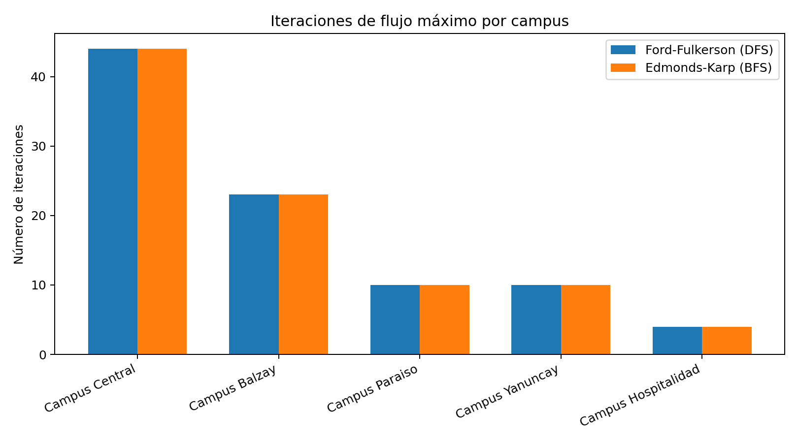

**Figura 21.** Flujo máximo por campus.
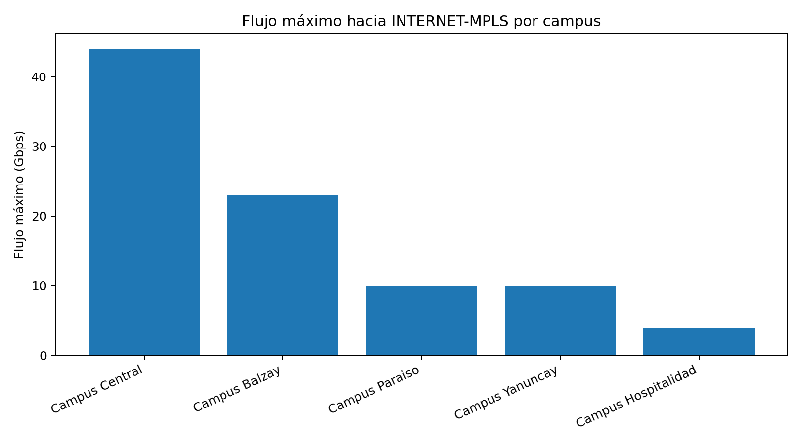

**FF y EK alcanzan exactamente el mismo flujo máximo en los cinco campus**, como exige el teorema de flujo máximo–corte mínimo. En esta red el número total de iteraciones coincidió para cada campus, pero las secuencias de caminos difieren: en Campus Central, por ejemplo, las longitudes de los caminos aumentantes de FF (DFS) suben y bajan irregularmente, mientras que en EK (BFS) son **no decrecientes**, la propiedad característica del algoritmo (detalle en `04_iteraciones_caminos_aumentantes.csv`).

#### 4.2.3 Corte mínimo: interpretación y relación con los puentes de P1

**Tabla 23.** Corte mínimo por campus frente a los puentes identificados en P1 (`06_comparacion_corte_vs_puentes.csv`).

| Campus | Aristas del corte | También son puentes P1 | % | Capacidad del corte (Gbps) |
|---|---:|---:|---:|---:|
| Campus Balzay | 23 | 23 | 100 % | 23.0 |
| Campus Central | 7 | 2 | 28.6 % | 44.0 |
| Campus Hospitalidad | 4 | 4 | 100 % | 4.0 |
| Campus Paraíso | 1 | 1 | 100 % | 10.0 |
| Campus Yanuncay | 1 | 1 | 100 % | 10.0 |

**Paraíso** y **Yanuncay** tienen un corte mínimo de una sola arista (`CPAR-C10 → ROUTER-CAMPUS-HUAYNA-CAPAC` y `AGRPRI-1A-D10 → ROUTER-CAMPUS-YANUNCAY`, respectivamente, ambas de 10 Gbps), y en ambos casos esa arista es también un puente de P1: confirmación directa, ya con capacidades reales, de que la conexión hacia el router WAN de esos campus es un **cuello de botella estructural sin alternativa topológica en el grafo**. **Hospitalidad** alcanza solo 4 Gbps de flujo máximo pese a que su salida WAN modelada admite 10 Gbps: el cuello de botella está *antes*, en los cuatro enlaces individuales de 1 Gbps de sus equipos de acceso. **Balzay** alcanza 23 Gbps con un corte de 23 aristas, todas puentes: la redundancia observada en capas superiores (core-agregación, sección 2.1.6) no elimina el *single-homing* de los equipos de acceso — la limitación está en el borde de la red, no en el *backbone*. **Campus Central** es el caso más distinto: su corte de 7 aristas incluye solo 2 puentes de P1, es decir, la mayoría de las aristas del corte **no son puentes** — la capacidad máxima de 44 Gbps está determinada por la suma de varias fronteras de capacidad (varios enlaces de alta capacidad de *core*/WAN en conjunto), no por un único enlace crítico. Esto confirma que **un puente y una arista de corte mínimo no son el mismo concepto**: el puente mide vulnerabilidad topológica pura (su eliminación desconecta el grafo), el corte mínimo incorpora capacidad y puede estar formado por varias aristas no-puente cuya suma limita el flujo.

**Verificación manual (Campus Central).** Las capacidades de las 7 aristas del corte suman 1000+1000+1000+1000+10000+10000+20000 = **44 000 Mbps = 44.0 Gbps**, exactamente igual al flujo máximo calculado — verificación directa del teorema max-flow/min-cut (`07_verificacion_manual_corte_central.csv`).

#### 4.2.4 Flujo de costo mínimo

Se formuló una variante con demanda fija: 5 Gbps desde Campus Central y 5 Gbps desde Campus Balzay (10 Gbps en total) hacia `INTERNET-MPLS`, con un costo por unidad de flujo según el `rol` del enlace (principal/wan/inferido = 1; secundario = 3; respaldo = 6 — penalizando el uso de enlaces de contingencia cuando no son necesarios), resuelto con `networkx.network_simplex`.

**Figura 22.** Distribución del flujo de costo mínimo por rol de enlace.
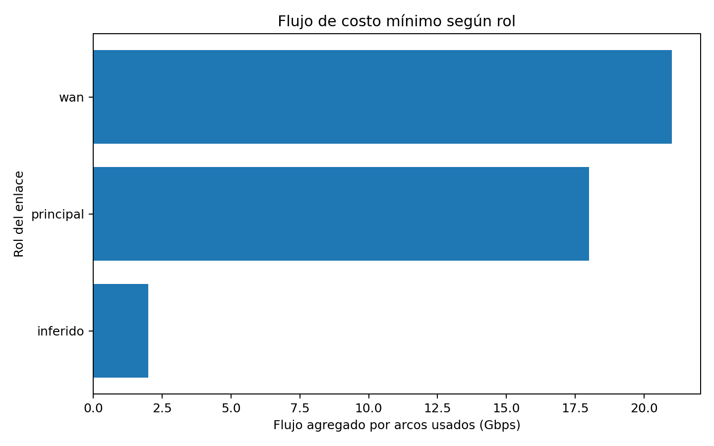

El costo mínimo obtenido para transportar los 10 Gbps de demanda fue **41 000** (4.10 unidades/Mbps en promedio), sin necesidad de usar ningún enlace de `respaldo` ni `secundario` — la capacidad de los enlaces principales/WAN bastó (`09_resumen_flujo_costo_minimo.csv`, descomposición completa en `10_mincost_descomposicion_caminos.csv`). Comparado con el flujo máximo puro combinando Central y Balzay en un solo problema (~62 Gbps), el flujo de costo mínimo transporta únicamente los 10 Gbps solicitados —≈16.1 % de ese máximo combinado—, porque resuelve un problema distinto: el flujo máximo busca enviar la mayor cantidad posible sin importar el costo de las rutas, mientras el de costo mínimo recibe una demanda ya fija y decide *por dónde* enviarla para minimizar un criterio operativo adicional.

### 4.3 P7 — Localización de instalaciones (colectores de telemetría)

#### 4.3.1 Formulación

Con *I* = conjunto de equipos, *J* = *V* (todos los nodos como candidatos), *d*ij = distancia mínima en saltos, *y*j∈{0,1} si se instala un colector en *j* y *x*ij∈{0,1} si *i* es atendido por *j*:

**p-mediana** (minimiza la distancia total, y por tanto la media):

min Σi∈I Σj∈J *d*ij*x*ij  sujeto a  Σj*x*ij=1 ∀i;  *x*ij≤*y*j ∀i,j;  Σj*y*j=*p*

**p-centro** (minimiza la distancia máxima, con variable auxiliar *z*):

min *z*  sujeto a las mismas restricciones de asignación/apertura, más  Σj*d*ij*x*ij ≤ *z* ∀i

Ambos se resolvieron con una **heurística voraz** (en p-mediana, agregar en cada paso el candidato que más reduce la suma de distancias; en p-centro, el que más reduce la distancia máxima) y con un **MILP exacto** (`scipy.optimize.milp`, HiGHS).

#### 4.3.2 Resultados para *p* ∈ {1, 2, 3, 5}

**Tabla 24.** Solución exacta (MILP) de p-mediana y p-centro (`02_resultados_localizacion.csv`, `03_ubicaciones_colectores.csv`).

| *p* | p-mediana: dist. media | p-mediana: dist. máx. | p-centro: dist. media | p-centro: dist. máx. |
|---:|---:|---:|---:|---:|
| 1 | 3.605 | 6 | 3.605 | 6 |
| 2 | 2.746 | 7 | 2.780 | 6 |
| 3 | 2.192 | 5 | 2.294 | 4 |
| 5 | 1.797 | 4 | 1.989 | **3** |

Con *p*=1 ambos modelos coinciden en `INTERNET-MPLS` (radio 6 saltos). A partir de *p*=2 divergen: p-mediana minimiza el promedio y puede *empeorar* el peor caso al crecer *p* (su distancia máxima sube a 7 con *p*=2 antes de volver a bajar), mientras p-centro sacrifica parte del promedio para proteger sistemáticamente al equipo peor ubicado — con *p*=5, p-centro logra que ningún equipo quede a más de 3 saltos de un colector, a costa de una distancia media (1.989) peor que la de p-mediana (1.797). La heurística voraz reproduce el óptimo exacto de p-mediana casi siempre (diferencia máxima 5.15 % en *p*=3) pero se aleja más en p-centro (diferencia de hasta 33 % en *p*=5) — la heurística voraz es menos confiable para minimizar un máximo que para minimizar una suma, y las tablas exactas (`06_voraz_vs_exacto.csv`) documentan la brecha.

**Figura 23.** Objetivo de p-mediana en función de *p* (voraz vs. exacto).
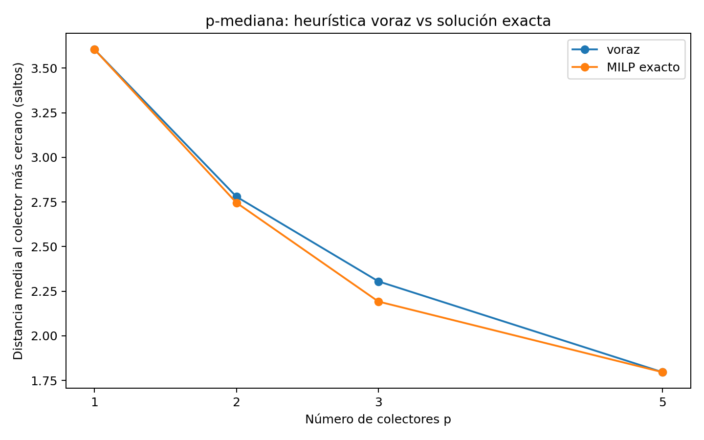

**Figura 24.** Objetivo de p-centro en función de *p* (voraz vs. exacto).
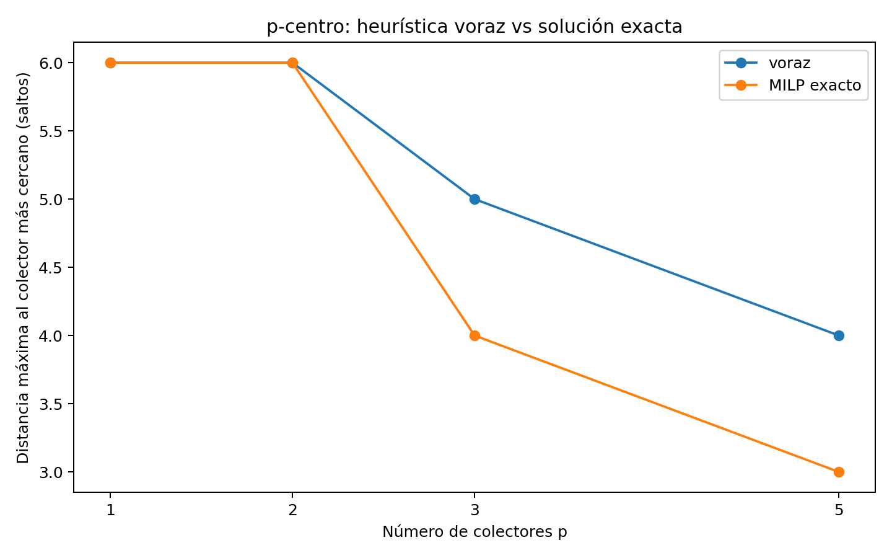

#### 4.3.3 ¿"Dónde poner un colector" = "el nodo más central"?

**No necesariamente.** Con *p*=1, `INTERNET-MPLS` (primero en cercanía de P1) es la elección natural. Pero al crecer *p* aparecen nodos lejos de cualquier ranking global de centralidad: en la solución de p-mediana con 5 colectores aparece `AGRPRI-1A-D10` (≈puesto 39 por cercanía); en p-centro con 5 colectores aparece `CB-EADMI-D6` (≈puesto 37) y, más extremo, `POST-1A-A65` (≈puesto **161** de 177 por cercanía, 54 por intermediación) — un nodo prácticamente periférico según cualquier medida individual de P1 (`04_comparacion_con_centralidades_P1.csv`). La razón es conceptual: la centralidad responde "¿qué nodo está bien situado respecto a *toda* la red?", mientras la localización responde "¿qué conjunto de *p* nodos, actuando *simultáneamente*, cubre mejor a todos los equipos?". Una vez que ya hay un colector en una zona central, añadir otro muy cerca aporta poco; conviene cubrir la zona peor atendida, aunque su mejor candidato sea individualmente poco central. `POST-1A-A65` ilustra el caso extremo: en la solución de 5 p-centros, su única función es asegurar que ningún equipo de la institución quede a más de 3 saltos de un colector.

#### 4.3.4 Restricciones prácticas omitidas por el modelo

El modelo base asume que **cualquier** nodo puede alojar un colector, lo cual no es realista: no todo equipo dispone de energía redundante, espacio en rack, acceso administrativo o condiciones de seguridad física adecuadas. Esto se incorpora con un parámetro binario de elegibilidad *a*j∈{0,1} y la restricción adicional *y*j ≤ *a*j ∀j, que excluye automáticamente ubicaciones no viables. También podrían añadirse costos de licencia/instalación bajo presupuesto, o una capacidad máxima *Q*j por colector frente a la telemetría generada *q*i por cada equipo (Σi *q*i*x*ij ≤ *Q*j*y*j), acercando el modelo a una decisión de despliegue real en vez de puramente topológica.

### 4.4 Síntesis de la Fase 3

Dijkstra y Floyd-Warshall producen resultados idénticos (verificado en 60 comparaciones), pero Dijkstra es preferible en esta red dispersa tanto para consultas individuales como, a partir de ≈75 nodos, para el cálculo de todos los pares. El modelo de peso importa: saltos y latencia identifican centralidades similares, pero un peso basado en tráfico instantáneo altera radicalmente el ranking y es, además, desaconsejable como métrica de enrutamiento dinámico por su riesgo de oscilación. El flujo máximo por campus confirma con datos de capacidad reales dos de los hallazgos topológicos de fases anteriores: **Paraíso y Yanuncay dependen de un único enlace de 10 Gbps hacia su router WAN** (corte mínimo = puente), mientras **Balzay y Hospitalidad** tienen su cuello de botella en el borde de acceso, no en el *backbone* — y **Central** es la única red con un corte mínimo genuinamente distribuido entre varias aristas no-puente. Finalmente, P7 muestra que un colector de telemetría no debe ubicarse simplemente en "el nodo más central": con varios colectores, el valor marginal de una ubicación depende de qué zonas ya cubren los demás. Estos tres resultados —cuellos de botella de capacidad, dependencia de un único enlace por campus y la brecha entre centralidad individual y cobertura conjunta— alimentan directamente el índice compuesto de criticidad de la Fase 4 (P10).

## 5. Fase 4 — Percolación y robustez (P8–P10)

*Unidad 4 del sílabo. Scripts: `scripts/08_p8_percolacion.py`, `scripts/09_p9_cascadas_sir.py`, `scripts/10_p10_ranking_criticos.py`. Resultados en `resultados/tablas/` y `resultados/figuras/`.*

### 5.1 P8 — Percolación de nodos y enlaces

#### 5.1.1 Metodología

Se estudió la robustez eliminando progresivamente una fracción *f* de nodos (o enlaces) y midiendo el tamaño relativo de la componente gigante *S*(*f*) = |GCC(*f*)| / 177. Para nodos se implementaron las **cuatro estrategias** exigidas: (a) fallo aleatorio, promediado sobre **100 realizaciones** con desviación estándar; (b) ataque por grado descendente; (c) ataque por intermediación descendente (calculada una sola vez, sobre la red intacta); (d) ataque por intermediación **recalculada tras cada eliminación** (la estrategia adaptativa, computacionalmente más costosa: requiere recalcular *betweenness* de toda la red en cada paso). Se estima *f*c como la fracción en la que la segunda componente conexa alcanza su tamaño máximo, y *f*50 como la primera fracción en la que *S*(*f*) ≤ 0.5. La eficiencia global se calculó como *E* = [1/(*n*(*n*−1))] Σi≠j 1/*d*ij, con valor inicial **E(0) = 0.2082**.

#### 5.1.2 Percolación de nodos: aleatoria vs. dirigida

**Tabla 25.** Umbrales de percolación de nodos por estrategia (`06_umbrales_fc_f50.csv`).

| Estrategia | *f*c | *f*50 |
|---|---:|---:|
| Fallo aleatorio (media de 100) | 0.271 | 0.237 |
| Grado descendente | 0.011 | 0.023 |
| Intermediación descendente | 0.051 | 0.045 |
| Intermediación recalculada (adaptativa) | 0.011 | 0.023 |

**Figura 25.** *S*(*f*) frente a *f* para las cuatro estrategias de percolación de nodos.
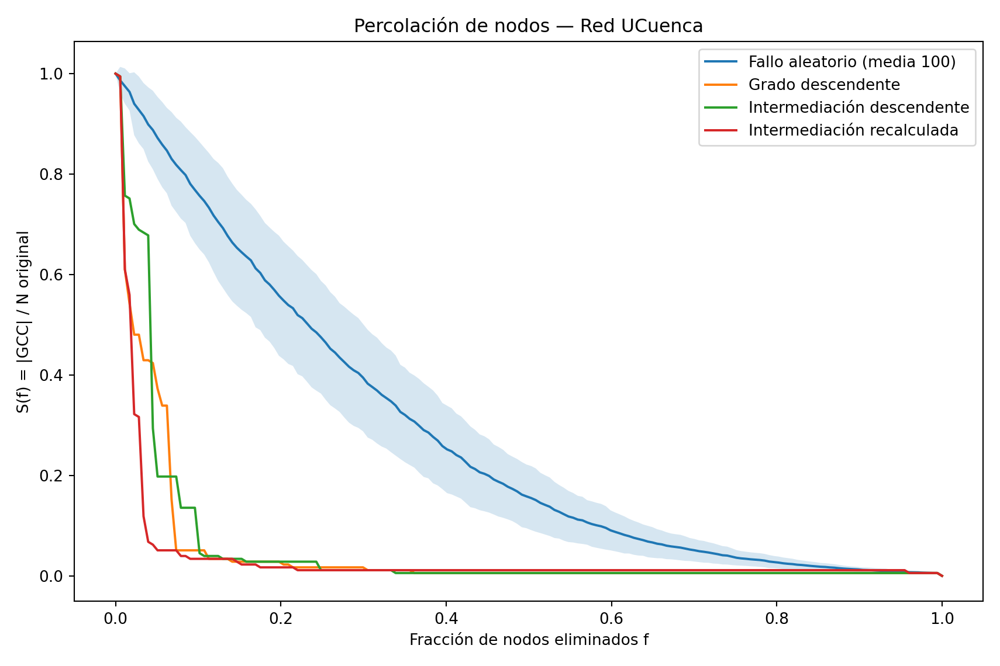

El contraste es muy fuerte: con fallos **aleatorios** hace falta eliminar ≈23.7 % de los nodos para que la componente gigante promedio caiga por debajo de la mitad; con un ataque por **grado** o por **intermediación adaptativa** basta ≈2.26 % — es decir, **apenas cuatro nodos**. Con solo 5 % de nodos eliminados, el fallo aleatorio conserva en promedio *S* ≈ 0.872, mientras el ataque adaptativo ya deja *S* ≈ 0.051. La desviación estándar del fallo aleatorio es apreciable (p. ej., *S* = 0.757 ± 0.107 en *f*=0.10), evidencia de que el impacto de una misma cantidad de fallos depende fuertemente de *cuáles* equipos concretos fallan. El ataque por grado comienza eliminando `DATCC-2A-C3` y `DATCC-2A-C2` —los dos nodos de mayor grado—; la primera eliminación apenas fragmenta la red (*S*≈0.994), pero al perder también el segundo *core* de Central la componente gigante cae a *S*≈0.610: **la red tolera la pérdida de uno de los dos *cores* de Central, pero no la de ambos simultáneamente**. El ataque adaptativo, tras `DATCC-2A-C3` y `DATCC-2A-C2`, continúa con `INTERNET-MPLS`, `CPAR-C10` y los *cores* de Balzay.

#### 5.1.3 Percolación de enlaces

**Tabla 26.** Umbrales de percolación de enlaces por estrategia.

| Estrategia | *f*c | *f*50 |
|---|---:|---:|
| Fallo aleatorio | 0.474 | 0.364 |
| Intermediación de arista (fija) | 0.005 | 0.177 |
| Intermediación de arista (adaptativa) | 0.033 | **0.033** |
| Puentes de P1 primero (por intermediación) | 0.005 | 0.220 |

**Figura 26.** *S*(*f*) frente a *f* para las estrategias de percolación de enlaces.
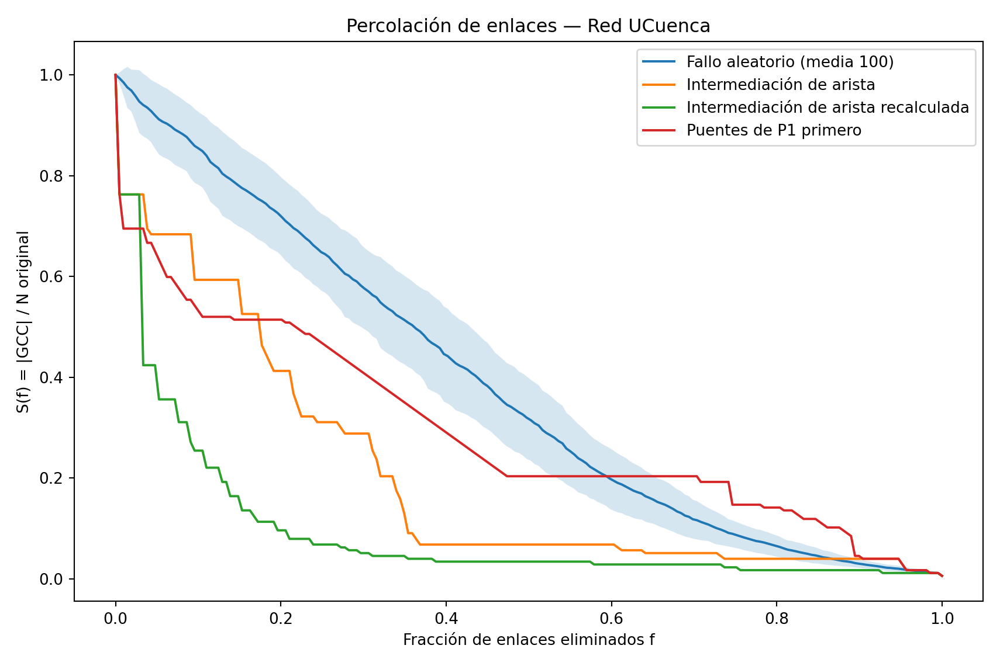

El ataque **adaptativo por intermediación de arista** es el más destructivo por *f*50: con solo ≈3.35 % de enlaces eliminados la componente gigante ya cae por debajo de la mitad. El ataque dirigido específicamente a los **puentes de P1** (ordenados por intermediación) tiene un efecto inicial dramático: el primer puente seleccionado, `CPAR-C10 — ROUTER-CAMPUS-HUAYNA-CAPAC` —el mismo enlace ya identificado en P1 como puente y en P6 como único corte mínimo de Campus Paraíso—, al eliminarse solo (1/209 ≈ 0.48 % de las aristas) hace caer *S* de 1.0 a **0.763**, separando de golpe una componente de ≈42 nodos. Sin embargo, atacar *todos* los puentes en orden no es tan destructivo en conjunto como recalcular continuamente la arista de mayor intermediación, porque muchos puentes solo aíslan ramas de acceso pequeñas.

#### 5.1.4 Eficiencia global

**Figura 27.** Eficiencia global *E*(*f*)/*E*(0) para las cuatro estrategias de percolación de nodos.
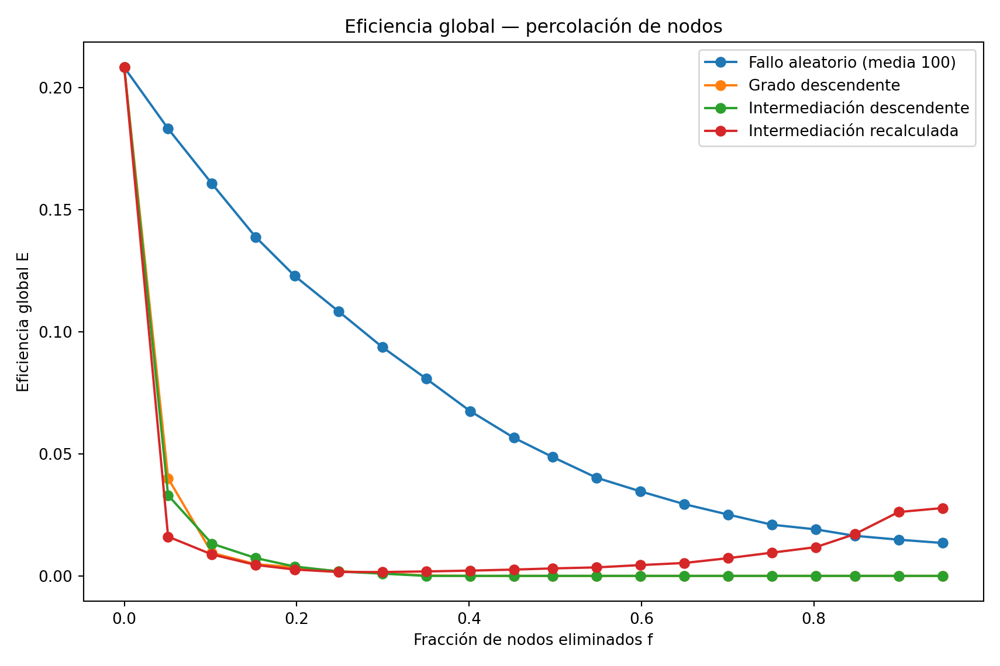

La eficiencia se degrada **antes** de que colapse la componente gigante: tras eliminar solo los dos nodos de mayor grado (*f*≈0.0113), *S* aún conserva ≈61.0 % de los nodos, pero la eficiencia ya cayó a ≈44.7 % de *E*(0); con el ataque por intermediación fija, tras 4 eliminaciones (*f*≈0.0226), *S*≈0.701 mientras la eficiencia es solo ≈60.7 % de *E*(0). Esto ocurre porque se pierden atajos y aumentan las distancias entre equipos que siguen técnicamente conectados: **el rendimiento operativo de la red se degrada de forma medible antes de que se produzca una fragmentación visible en el tamaño de la componente gigante**, un matiz importante para monitoreo temprano.

#### 5.1.5 Comparación con los modelos nulos de P2

**Tabla 27.** *f*50 relativo (respecto al tamaño inicial de la componente gigante de cada modelo) — red real vs. modelo de configuración vs. Erdős–Rényi.

| Ataque | UCuenca | Configuración | Erdős–Rényi |
|---|---:|---:|---:|
| Fallo aleatorio | **0.237** | 0.322 | 0.311 |
| Grado descendente | **0.023** | 0.062 | 0.113 |

**Figura 28.** Curvas de percolación (fallo aleatorio): red real vs. modelos nulos.
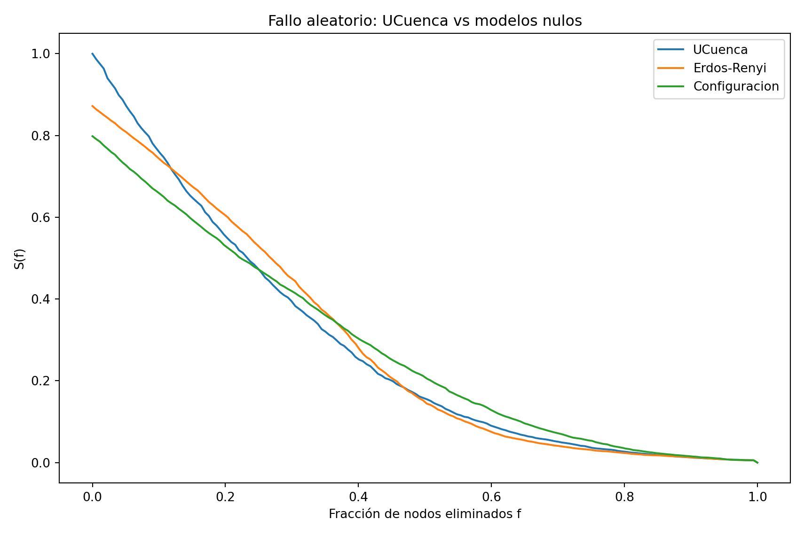

**Figura 29.** Curvas de percolación (ataque por grado): red real vs. modelos nulos.
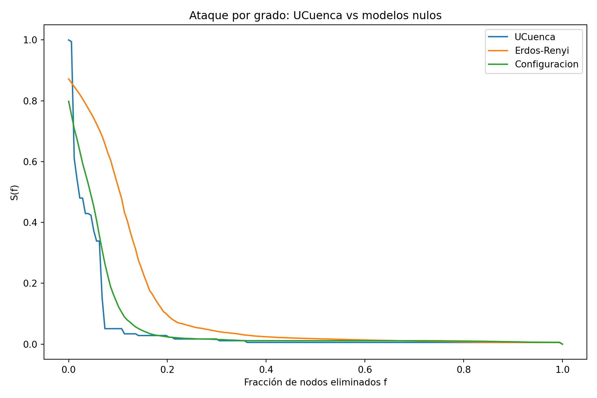

La comparación más relevante es con el modelo de **configuración**, porque preserva exactamente la secuencia de grados de la red real. En ambos tipos de ataque, UCuenca colapsa con una fracción *menor* de elementos eliminados que el modelo de configuración (0.237 vs. 0.322 bajo fallo aleatorio; 0.023 vs. 0.062 bajo ataque por grado). **La red UCuenca es más frágil de lo que su propia secuencia de grados haría esperar**: no basta con tener pocos hubs de grado alto para explicar la fragilidad observada — importa también *dónde* están ubicados esos hubs dentro de la jerarquía y cuánta de la conectividad depende de puentes y puntos de articulación específicos, algo que el modelo de configuración destruye al mezclar aleatoriamente las conexiones.

#### 5.1.6 ¿Se confirma el patrón "robusta a fallos aleatorios, frágil a ataques dirigidos"?

**Sí, cualitativamente, pero con un matiz importante.** El *f*50 de nodos pasa de ≈0.237 (aleatorio) a ≈0.023 (dirigido) — una diferencia de más de un orden de magnitud, la firma clásica de redes con distribución de grado heterogénea. El matiz es que, frente al modelo de configuración con su misma secuencia de grados, UCuenca **no es especialmente robusta ni siquiera ante fallos aleatorios** (sección 5.1.5): la topología jerárquica y la abundancia de puentes la hacen deteriorarse más rápido que una red aleatoria equivalente en grados.

**Consecuencias operativas.** Para **mantenimiento**: no debe planificarse solo por la cantidad de equipos que quedarán fuera de servicio, sino por *cuáles* se intervienen simultáneamente — en particular, `DATCC-2A-C3` y `DATCC-2A-C2` no deberían quedar fuera de servicio al mismo tiempo, y antes de intervenir un enlace crítico debe verificarse que el camino redundante esté realmente operativo. Para **respuesta ante incidentes de seguridad**: un atacante racional prioriza *cores*, *routers*, *firewalls* o enlaces de alto tránsito, por lo que el escenario relevante para ciberseguridad se parece mucho más al ataque dirigido que al fallo aleatorio; además, la estrategia adaptativa muestra que tras aislar un elemento crítico **la criticidad del resto cambia**, por lo que una respuesta a incidentes debería recalcular la topología efectiva tras cada aislamiento en vez de depender de un ranking fijo calculado antes del incidente.

### 5.2 P9 — Propagación de fallos y epidemias

#### 5.2.1 Modelo de cascada por sobrecarga

Se asignó a cada nodo *i* una carga inicial *L*i igual a su intermediación normalizada de P1, y una capacidad *C*i = (1+τ)*L*i, con margen de tolerancia τ. Al eliminar un nodo disparador, se recalcula la intermediación sobre la topología superviviente (proxy de la redistribución de carga por los nuevos caminos más cortos); todo nodo cuya carga recalculada supera su capacidad falla en la siguiente generación, y el proceso continúa hasta que no aparecen nuevas sobrecargas. Es un modelo topológico de carga-capacidad —la intermediación funciona como *proxy* de tráfico, no como una medición real en Mbps— y es deliberadamente **conservador**: los nodos con intermediación inicial cero también tienen capacidad inicial cero, por lo que cualquier carga positiva tras una falla puede declararlos sobrecargados.

**Tabla 28.** Margen crítico τc: disparador de mayor daño según τ.

| τ | Disparador de mayor daño | Fallos | Fracción afectada |
|---:|---|---:|---:|
| 0.000 | `CCJ-CJURIDICO-D4` | 62 | 35.0 % |
| 0.035 | `ROUTER-CAMPUS-CENTRO-HISTORICO` | 38 | **21.5 %** |
| 0.040 | `DATCC-2A-C3` | 13 | 7.3 % |

**Figura 30.** Tamaño de la cascada máxima en función del margen de tolerancia τ, con el margen crítico τc señalado.
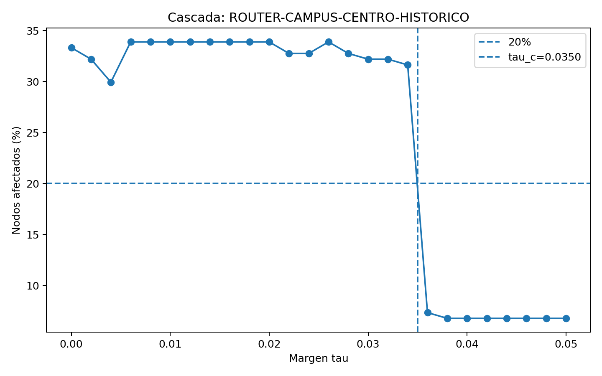

El margen crítico obtenido es **τc ≈ 0.035** (≈3.5 % de tolerancia adicional sobre la carga inicial): justo por debajo de ese valor, la falla aislada de `ROUTER-CAMPUS-CENTRO-HISTORICO` (Sede Centro Histórico, capa WAN) todavía provoca una cascada que afecta a más del 20 % de la red (38 fallos, 21.5 %, en cuatro generaciones: 1→2→3→32 nodos); por encima de τc, la cascada máxima cae por debajo de ese criterio (13 fallos con τ=0.040). Con τ=0 (sin ningún margen), los disparadores más peligrosos alcanzan hasta 62 fallos (35.0 % de la red) — encabezados por `CCJ-CJURIDICO-D4`, `HOS-0A-D05`, y varios equipos de acceso de Paraíso y Balzay (`05_top_disparadores_tau0.csv`) —, pero **el ranking de disparadores depende fuertemente del margen operativo considerado**: a τ=0.035 casi todos esos disparadores ya no superan el umbral del 20 %, y solo `ROUTER-CAMPUS-CENTRO-HISTORICO` lo sigue haciendo.

#### 5.2.2 Modelo SIR y umbral epidémico

Se simuló un modelo SIR continuo tipo Gillespie (tasa de transmisión β por enlace susceptible-infectado, tasa de recuperación μ=1, λ=β/μ), con 500 realizaciones por valor de λ desde un nodo infectado inicial aleatorio, considerando "brote grande" aquel que afecta a más del 20 % de los equipos.

**Figura 31.** Tamaño final del brote en función de λ, con el umbral empírico y la predicción de campo medio señalados.
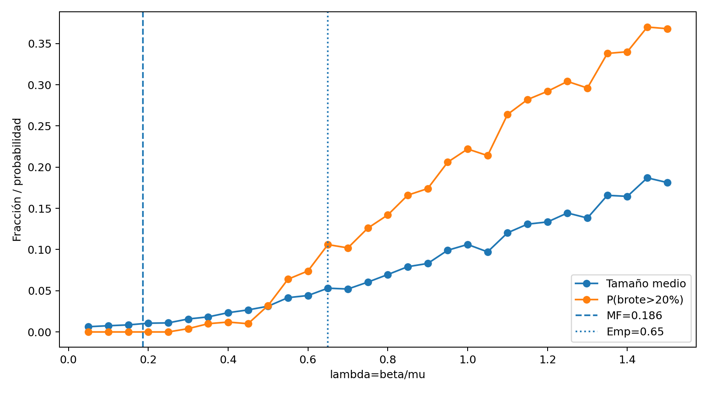

La predicción de campo medio es λcMF ≈ ⟨k⟩/⟨k²⟩, con ⟨k⟩=2.3616 y ⟨k²⟩=12.6893, lo que da **λcMF ≈ 0.186**. El umbral empírico observado (primera λ para la que ≥10 % de las realizaciones produce un brote >20 % de la red) es **λcemp ≈ 0.75**, notablemente mayor que la predicción de campo medio. Esto no invalida la fórmula: la aproximación de campo medio supone una red grande y bien mezclada, mientras UCuenca es pequeña, jerárquica, modular y con numerosos puentes y ramas terminales que dificultan la propagación —el indicador de susceptibilidad finita alcanza su máximo en torno a λ≈1.40, confirmando que la transición es ancha y no un punto crítico perfectamente definido, como cabría esperar en una red finita y estructurada—.

#### 5.2.3 Inmunización: aleatoria vs. por centralidad

**Tabla 29.** Comparación de estrategias de inmunización con presupuesto *m*=10 equipos (λ=1.0, 1000 simulaciones por estrategia).

| Estrategia | *m* | Brote final medio | P(brote > 20 %) | Reducción media vs. base |
|---|---:|---:|---:|---:|
| Ninguna | 0 | 10.13 % | 22.3 % | — |
| Aleatoria | 10 | 8.03 % | 17.4 % | 20.8 % |
| Por centralidad | 10 | **1.82 %** | **0.0 %** | **82.1 %** |

**Figura 32.** Comparación de estrategias de inmunización.
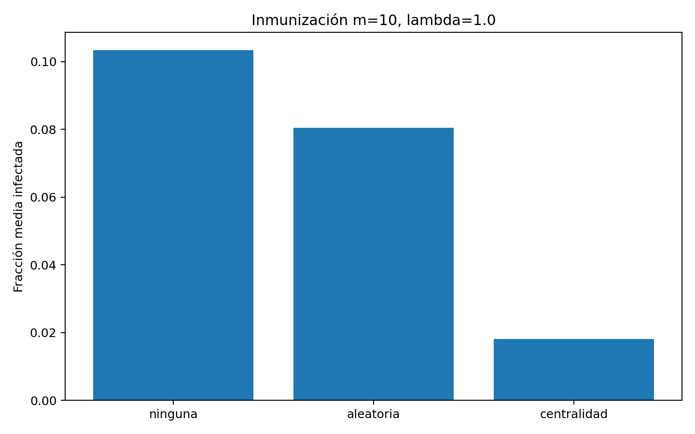

Con el mismo presupuesto de 10 equipos, inmunizar por centralidad (los diez nodos de mayor intermediación de P1: `DATCC-2A-C3`, `CPAR-C10`, `ROUTER-CAMPUS-HUAYNA-CAPAC`, `INTERNET-MPLS`, `PE2-CENTRAL`, entre otros) reduce el tamaño medio del brote en **82.1 %** y, en 1000 simulaciones, **ningún brote superó el 20 % de la red**; la inmunización aleatoria solo logra una reducción de 20.8 %. La razón es estructural: los nodos de alta intermediación conectan regiones enteras de la infraestructura, así que parchearlos no solo protege diez equipos puntuales, sino que rompe simultáneamente múltiples rutas de propagación entre comunidades y campus.

#### 5.2.4 Analogía con un sistema de energía eléctrica

El mecanismo de carga-capacidad-redistribución-cascada tiene una analogía directa, aunque simplificada, con una red de transmisión eléctrica: la carga *L*i corresponde al flujo o esfuerzo soportado por un elemento de transmisión; la capacidad *C*i corresponde a límites térmicos, operativos o de estabilidad de líneas y transformadores; la redistribución tras la pérdida de un elemento corresponde a cómo el flujo eléctrico se reparte por la red restante; y la cascada corresponde a la desconexión sucesiva por protecciones cuando los nuevos flujos superan límites de otros elementos. La analogía tiene un límite fundamental: **los flujos eléctricos reales no siguen caminos mínimos**, sino que obedecen las leyes de Kirchhoff y requieren modelos de flujo de potencia AC/DC; el modelo de P9 captura el mecanismo conceptual de sobrecarga-redistribución-nueva falla, pero no sustituye un análisis eléctrico real. Como referencia de la bibliografía del módulo, **Newman (2010)** presenta el marco general de procesos dinámicos sobre redes, y **Latora, Nicosia y Russo (2017)** desarrollan específicamente robustez, difusión y dinámica sobre redes complejas.

### 5.3 P10 — Diagnóstico de puntos críticos

#### 5.3.1 Índice compuesto

Se definió, para cada nodo *i*:

*I*i = 0.25 *B*i + 0.10 *A*i + 0.20 *M*i + 0.15 *P*i + 0.30 *C*i

donde *B*i es la intermediación de P1 normalizada al máximo (25 %: importancia como corredor de caminos mínimos); *A*i es 1 si el nodo es punto de articulación y 0 si no (10 %: indicador binario cuyo peso es menor porque parte de su efecto ya lo recoge *P*i); *M*i es la participación normalizada en los cortes mínimos de P6, ponderada por la fracción de capacidad del corte que aporta cada arista incidente (20 %: incorpora capacidad y cuello de botella); *P*i es el daño topológico de eliminar aisladamente el nodo, 1−|GCC(*G*−*i*)|/(*N*−1), normalizado al máximo observado (15 %: fragmentación por falla aislada); y *C*i es el daño de cascada de P9 a τ=0.035 (fracción de fallos secundarios, normalizada al máximo), con el **peso más alto (30 %)** porque es la única métrica que incorpora explícitamente la propagación dinámica del daño, la consecuencia sistémica más directa de una falla. Como control de robustez del propio índice, se repitió el cálculo con pesos iguales (20 % cada componente): **8 de los 10 nodos del top-10 se mantienen en ambos rankings**, evidencia de que el diagnóstico no depende críticamente de la ponderación elegida.

#### 5.3.2 Top-10 de puntos críticos

**Tabla 30.** Top-10 del índice compuesto de criticidad (`02_top10_fichas.csv`).

| # | Nodo | Campus | Función | Índice | Evidencias principales |
|---:|---|---|---|---:|---|
| 1 | `CPAR-C10` | Paraíso | Núcleo (core) | **0.673** | B=0.404; punto de articulación; corte mínimo de Paraíso; 41 nodos fuera de GCC si falla |
| 2 | `ROUTER-CAMPUS-HUAYNA-CAPAC` | Paraíso | Router WAN | **0.655** | B=0.366; punto de articulación; corte mínimo de Paraíso; 42 nodos fuera de GCC si falla |
| 3 | `DATCC-2A-C3` | Central | Núcleo (core) | **0.484** | B=0.447; corte mínimo de Central; cascada: +12 fallos |
| 4 | `INTERNET-MPLS` | Nube MPLS | Salida institucional | **0.422** | B=0.366; punto de articulación; 8 nodos fuera de GCC; cascada: +11 fallos |
| 5 | `ROUTER-CAMPUS-YANUNCAY` | Yanuncay | Router WAN | **0.414** | B=0.128; punto de articulación; corte mínimo de Yanuncay; 12 nodos fuera de GCC |
| 6 | `AGRPRI-1A-D10` | Yanuncay | Agregación | **0.407** | B=0.121; punto de articulación; corte mínimo de Yanuncay; 11 nodos fuera de GCC |
| 7 | `HOS-0A-D05` | Hospitalidad | Agregación | **0.340** | B=0.045; punto de articulación; corte mínimo de Hospitalidad; 4 nodos fuera de GCC |
| 8 | `ROUTER-CAMPUS-CENTRO-HISTORICO` | Sede Centro Histórico | Router WAN | **0.307** | B=0.004; corte mínimo de Central; cascada: **+37 fallos** |
| 9 | `PE2-CENTRAL` | Central | Router PE / tránsito WAN | **0.293** | B=0.288; corte mínimo de Central; cascada: +5 fallos |
| 10 | `BAL-AUL2-D1` | Balzay | Agregación | **0.285** | B=0.111; punto de articulación; corte mínimo de Balzay; 10 nodos fuera de GCC |

**Figura 33.** Top-10 del índice compuesto de criticidad.
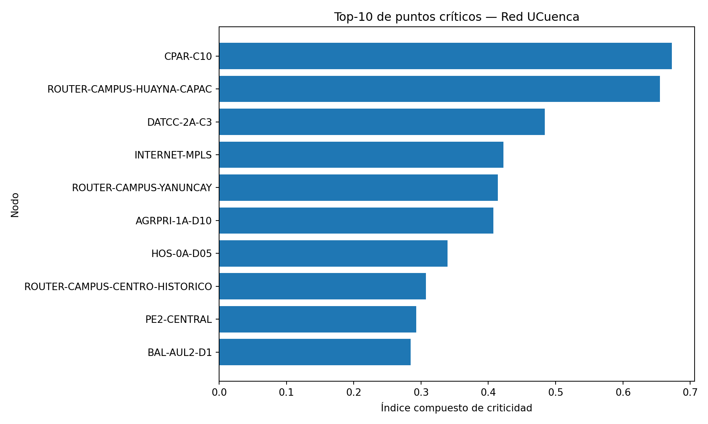

**Figura 34.** Composición del índice de criticidad por componente, top-10.
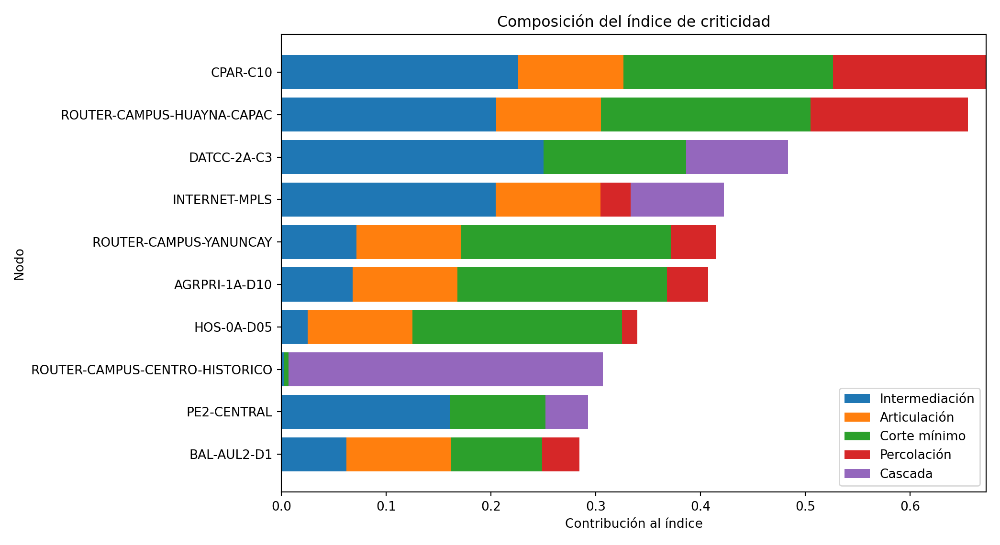

#### 5.3.3 Lectura del ranking

**Paraíso domina los dos primeros puestos.** `CPAR-C10` y `ROUTER-CAMPUS-HUAYNA-CAPAC` reúnen simultáneamente intermediación muy alta, condición de punto de articulación, participación directa en el corte mínimo de Paraíso y el mayor daño de fragmentación de toda la red. El enlace que los une (`CPAR-C10 — ROUTER-CAMPUS-HUAYNA-CAPAC`) ya había aparecido de forma independiente como puente en P1, como único corte mínimo de Paraíso en P6 y como uno de los enlaces de mayor impacto en P8: es el **punto único de fallo más consistentemente respaldado por evidencia independiente de todo el proyecto**.

**Campus Central es crítico por tránsito, no por articulación única.** `DATCC-2A-C3` no es punto de articulación (confirma la redundancia parcial del *core* de Central detectada en P1), pero concentra la mayor intermediación de toda la red y participa en su corte mínimo — **no ser punto de articulación no significa no ser crítico**: un nodo con ruta alternativa puede seguir siendo operacionalmente crítico si su falla desplaza mucho tránsito hacia pocos caminos restantes.

**El caso de Centro Histórico justifica haber integrado P9.** `ROUTER-CAMPUS-CENTRO-HISTORICO` tiene intermediación estática casi nula (0.004) y no es punto de articulación; si el índice se hubiera construido solo con centralidades de P1, este equipo prácticamente desaparecería del diagnóstico. Aparece en el puesto 8 exclusivamente porque, a τ=0.035, su falla desencadena la mayor cascada secundaria observada (+37 fallos) — un nodo aparentemente irrelevante puede ser un disparador peligroso una vez que se modela la redistribución dinámica de carga.

#### 5.3.4 Alcance y limitaciones del índice

El índice compuesto es una herramienta de **priorización**, no una medida física absoluta de riesgo: (1) los pesos son una decisión de modelado — la comparación 8/10 con pesos iguales sugiere estabilidad razonable, pero algunos puestos individuales sí pueden cambiar; (2) la participación en cortes mínimos hereda las capacidades *estimadas* en P6 (28 de 209 aristas con dato explícito); y (3) el daño de cascada depende del modelo simplificado de P9 y del valor de τ elegido, y la intermediación es un *proxy* de carga, no tráfico real medido. El ranking debe leerse como evidencia cuantitativa para decidir **qué inspeccionar y reforzar primero**, no como sustituto de inventario físico y pruebas reales de *failover*.

### 5.4 Síntesis de la Fase 4

La red UCuenca exhibe el patrón clásico de robustez frente a fallos aleatorios y fragilidad frente a ataques dirigidos (más de un orden de magnitud de diferencia en *f*50), pero resulta **más frágil de lo que su propia secuencia de grados predeciría** frente al modelo de configuración — la fragilidad no depende solo de tener hubs, sino de dónde están ubicados dentro de la jerarquía. El modelo de cascada identifica un margen crítico estrecho (τc≈3.5 %) por debajo del cual un único disparador WAN puede afectar a más de una quinta parte de la infraestructura, y el modelo SIR muestra que, aunque la topología jerárquica retrasa la propagación epidémica respecto a la predicción homogénea de campo medio, superado ese umbral los brotes son extensos — y que inmunizar por centralidad, con el mismo presupuesto que inmunizar al azar, reduce el tamaño del brote cuatro veces más. El índice compuesto de P10 consolida toda esta evidencia en un ranking único encabezado por el par `CPAR-C10`/`ROUTER-CAMPUS-HUAYNA-CAPAC` de Campus Paraíso, y revela que algunos nodos (`ROUTER-CAMPUS-CENTRO-HISTORICO`) solo son visibles como críticos cuando se incorpora la dinámica de cascada — este top-10, con su desglose de qué tipo de vulnerabilidad domina en cada caso (articulación, tránsito o disparo de cascada), es la base directa sobre la que se formula la propuesta de rediseño de la Fase 5.

## 6. Fase 5 — Propuesta de rediseño (P11)

*Unidad 5 del sílabo. Script: `scripts/11_p11_rediseno.py`. Resultados en `resultados/tablas/01…10_*.csv` y `resultados/figuras/`.*

### 6.1 Criterio de diseño y las cinco intervenciones

Con el diagnóstico consolidado de P10, la propuesta se sujeta a una restricción dura: **a lo sumo cinco enlaces nuevos**. El criterio no fue simplemente "unir los nodos más centrales", sino usar los cinco cambios para atacar directamente las dependencias identificadas a lo largo de todo el proyecto —puentes y puntos de articulación de P1, cuellos de botella de P6, sensibilidad al ataque dirigido de P8 y el top-10 de P10—, priorizando enlaces que crean **caminos realmente alternativos** y **distribuyendo** la redundancia entre varias sedes en vez de concentrar las cinco mejoras en un único nodo.

**Tabla 31.** Las cinco intervenciones propuestas (`07_intervenciones_propuestas.csv`).

| ID | Enlace nuevo | Capacidad | Problema que resuelve |
|---|---|---:|---|
| I1 | `CP-EADMINA1-D6` — `ROUTER-CAMPUS-PARAISO` | 10 Gbps | Salida alternativa para una de las ramas de agregación más grandes de Paraíso; contribuye a eliminar la dependencia de `CPAR-C10—ROUTER-CAMPUS-HUAYNA-CAPAC` (el punto crítico #1 de P10). |
| I2 | `CP-ODONTOLOGIA-D4` — `ROUTER-CAMPUS-PARAISO` | 10 Gbps | Segundo *bypass* del *core* `CPAR-C10` desde otra rama, para no depender de un único switch de agregación. |
| I3 | `DT-0A-C12` — `PE2-BALZAY` | 20 Gbps | Simetriza la salida de los dos *cores* de Balzay hacia PE2 (hoy el enlace 2×10G directo solo existe desde `DT-0A-C13`). |
| I4 | `AGRPRI-1A-D10` — `INTERNET-MPLS` | 10 Gbps | Segundo *uplink* MPLS para Yanuncay; elimina a `ROUTER-CAMPUS-YANUNCAY` como punto de articulación (punto crítico #5 de P10). |
| I5 | `HOS-0A-D05` — `PE2-CENTRAL` | 10 Gbps | Segundo camino WAN para Hospitalidad; elimina como puente el *uplink* `HOS-0A-D05—INTERNET-MPLS` (punto crítico #7 de P10). |

Con I1 e I2, el enlace `CPAR-C10—ROUTER-CAMPUS-HUAYNA-CAPAC` deja de ser puente y ese router deja de ser punto de articulación —usar **dos** ramas distintas de Paraíso evita que la nueva redundancia dependa a su vez de un único switch—. I3 no introduce redundancia estructural nueva tanto como *corrige una asimetría de diseño*: el segundo *core* de Balzay carecía de salida directa equivalente a la de su par. I5 es el caso más claro de "redundancia sin más *throughput*": el flujo máximo de Hospitalidad no cambia (su cuello de botella sigue en los cuatro accesos de 1 Gbps), pero el enlace crítico deja de ser puente.

### 6.2 Cuantificación de la mejora

**Tabla 32.** Métricas estructurales antes/después de las cinco intervenciones (`03_antes_despues_variacion.csv`).

| Métrica | Antes | Después | Variación |
|---|---:|---:|---:|
| Número de puentes | 141 | 136 | **−3.55 %** |
| Puntos de articulación | 47 | 45 | **−4.26 %** |
| Distancia media [saltos] | 5.830 | 5.495 | **−5.75 %** |
| Eficiencia global | 0.2082 | 0.2179 | **+4.66 %** |
| AUC de *S*(*f*), ataque adaptativo | 0.03388 | 0.03730 | **+10.08 %** |
| *f*50, ataque adaptativo | 0.02260 | 0.02260 | +0.00 % |
| *S*(*f*) con 5 % de nodos eliminados | 0.051 | 0.113 | **+122.22 %** |

Los cinco enlaces eliminan exactamente los cinco puentes esperados (`05_puentes_eliminados_por_propuesta.csv`: `CPAR-C10—ROUTER-CAMPUS-HUAYNA-CAPAC`, `CP-EADMINA1-D6—CPAR-C10`, `CP-ODONTOLOGIA-D4—CPAR-C10`, `AGRPRI-1A-D10—ROUTER-CAMPUS-YANUNCAY`, `HOS-0A-D05—INTERNET-MPLS`) y hacen que `ROUTER-CAMPUS-HUAYNA-CAPAC` y `ROUTER-CAMPUS-YANUNCAY` —ambos en el top-10 de P10— dejen de ser puntos de articulación. **El hallazgo más importante está en la percolación bajo ataque dirigido**: tras un ataque adaptativo que elimina el 5 % de los nodos, la componente gigante conservada **más que se duplica** (*S*≈0.051 → *S*≈0.113); sin embargo, el *f*50 —la fracción necesaria para colapsar la red a la mitad bajo el mismo ataque— **no cambia** (permanece en 0.0226). Esto es una lectura honesta y necesaria: cinco enlaces no eliminan la fragilidad estructural frente a una secuencia de ataque óptima concentrada en los *cores* de Central y la salida institucional; la mejora real se produce en la capacidad de la red para **conservar más servicio inmediatamente después de las primeras pérdidas críticas**, no en desplazar el punto de colapso total.

**Tabla 33.** Flujo máximo por campus, antes/después (`04_flujo_antes_despues.csv`).

| Campus | Antes (Gbps) | Después (Gbps) | Variación |
|---|---:|---:|---:|
| Campus Paraíso | 10.0 | **20.0** | **+100 %** |
| Campus Yanuncay | 10.0 | 11.0 | +10 % |
| Campus Central | 44.0 | 44.0 | +0 % |
| Campus Balzay | 23.0 | 23.0 | +0 % |
| Campus Hospitalidad | 4.0 | 4.0 | +0 % |

Paraíso duplica su flujo máximo (el corte mínimo, antes una sola arista de 10 Gbps, ahora se reparte entre tres rutas). Central, Balzay y Hospitalidad no cambian su flujo máximo porque sus cortes limitantes están en otro lugar de la red (el borde de acceso en Balzay/Hospitalidad, varias aristas distribuidas en Central) — lo cual no vuelve inútiles las intervenciones I3 e I5 en esos campus, cuyo objetivo explícito es redundancia de camino, no mayor capacidad.

**Figura 35.** Curvas de percolación bajo ataque adaptativo: red base vs. propuesta vs. alternativas ingenuas.
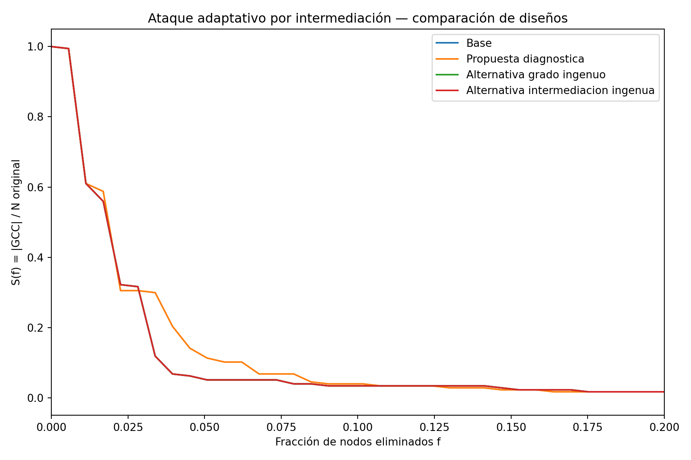

**Figura 36.** Flujo máximo por campus: red base vs. propuesta vs. alternativas.
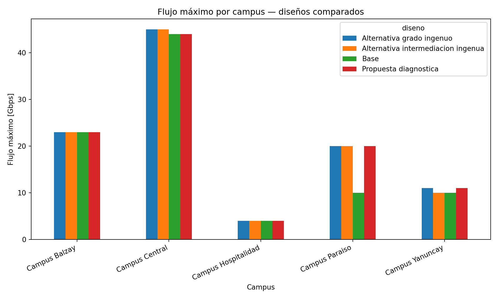

### 6.3 Comparación contra dos alternativas ingenuas

Se construyeron dos líneas base: **(A) grado ingenuo** —conectar el nodo de mayor grado con los primeros cinco nodos de grado alto con los que aún no tenía enlace— y **(B) intermediación ingenua** —lo mismo, ordenando por *betweenness*—.

**Tabla 34.** Propuesta diagnóstica vs. alternativas ingenuas (`01_metricas_todos_disenos.csv`).

| Diseño | Puentes | Articulaciones | Distancia media | Eficiencia | AUC ataque adaptativo | *S*(5 %) |
|---|---:|---:|---:|---:|---:|---:|
| Base (sin cambios) | 141 | 47 | 5.830 | 0.2082 | 0.03388 | 0.051 |
| **Propuesta diagnóstica** | **136** | **45** | 5.495 | 0.2179 | **0.03730** | **0.113** |
| Alternativa grado ingenuo | 138 | 45 | **4.521** | **0.2524** | 0.03388 | 0.051 |
| Alternativa intermediación ingenua | 140 | 46 | 4.658 | 0.2441 | 0.03388 | 0.051 |

Las alternativas ingenuas efectivamente logran **mejor distancia media y eficiencia global** que la propuesta diagnóstica —porque crean enlaces directos y largos hacia el mismo *hub* (`DATCC-2A-C3`), introduciendo atajos artificialmente eficaces—, pero eso mismo es su defecto: **concentran aún más la arquitectura alrededor del nodo que P10 ya clasificó como el de mayor intermediación de la red**. Bajo ataque adaptativo, ambas alternativas mantienen exactamente la misma AUC que la red sin cambios (0.03388, sin ninguna mejora de robustez), mientras la propuesta diagnóstica la incrementa a 0.03730. Además, su factibilidad es menor: implican varios enlaces directos entre campus terminando todos en el mismo *core* de Central, mientras la propuesta usa en lo posible equipos WAN y rutas ya existentes para construir redundancia **distribuida**. Las alternativas ingenuas serían preferibles si el único objetivo fuera reducir el número de saltos; la propuesta es preferible si el objetivo es **robustez operacional sin crear un nuevo super-*hub***, que es precisamente la pregunta de ingeniería que plantea el proyecto (sección 1.2).

### 6.4 Costo, factibilidad y limitaciones

El conjunto de datos no incluye coordenadas geográficas, longitudes de fibra, disponibilidad de ductos ni inventario de puertos, por lo que **no es posible presentar un costo monetario defendible**; se ofrece en su lugar una clasificación cualitativa de factibilidad relativa: I1/I2 (Paraíso) media-alta —enlaces intra-campus hacia un router ya existente, sujetos a verificar distancia entre edificios y puertos 10G disponibles—; I3 (Balzay) alta si los dos *cores* y PE2 están efectivamente co-ubicados; I4 (Yanuncay) y I5 (Hospitalidad) media —ambos implican un circuito adicional hacia un proveedor/PE externo, y **solo aportan redundancia real si tienen diversidad física de ruta** respecto al enlace existente—. Esta última salvedad es importante: **dos enlaces dibujados como distintos en el grafo no garantizan diversidad física** (mismo ducto, poste o proveedor invalidaría la redundancia topológica calculada).

El estudio no captura, y debe declararse explícitamente como limitación: (1) ubicación geográfica y longitud real de fibra; (2) puertos 10/20 Gbps efectivamente disponibles en los equipos; (3) que 181 de las 209 capacidades de la red base son *estimadas*, no medidas (sección 4.2.1); (4) grupos de riesgo de enlace compartido (SRLG) — dos enlaces pueden compartir ducto, energía o equipo de transporte sin que el grafo lo refleje; (5) que las centralidades y flujos no sustituyen matrices de tráfico horarias reales; (6) que protocolos y políticas (OSPF/IS-IS, MPLS, VRF, STP, LAG) pueden impedir que una conexión físicamente existente se use como el grafo supone; (7) ausencia de CAPEX/OPEX real sin metraje, obra civil, transceptores y cotizaciones; y (8) que una ruta nueva hacia un equipo crítico no sustituye la necesidad de redundar su energía, chasis y planos de control. Por estas razones, los cinco enlaces propuestos son una **priorización técnica para estudios de factibilidad**, no una orden directa de construcción.

### 6.5 Respuesta final de ingeniería

Si el equipo de este proyecto administrara la red y tuviera presupuesto para estudiar/construir cinco enlaces, la priorización sería exactamente la Tabla 31: `CP-EADMINA1-D6—ROUTER-CAMPUS-PARAISO` (10G), `CP-ODONTOLOGIA-D4—ROUTER-CAMPUS-PARAISO` (10G), `DT-0A-C12—PE2-BALZAY` (20G), `AGRPRI-1A-D10—INTERNET-MPLS` (10G, segundo circuito MPLS) y `HOS-0A-D05—PE2-CENTRAL` (10G, ruta WAN alternativa). No porque unan "los nodos más importantes" —de hecho, ninguna termina en `DATCC-2A-C3`—, sino porque eliminan cinco puentes y dos puntos de articulación identificados de forma independiente en P1, P6, P8 y P10; duplican el flujo máximo de Paraíso; y mejoran la supervivencia bajo ataque adaptativo, todo mientras distribuyen la redundancia entre cuatro sedes distintas en vez de concentrarla en un único *hub*. La propuesta **no es óptima en todas las métricas** —un esquema ingenuo de enlaces largos hacia el *core* Central reduce más la distancia media—, pero para una red institucional la decisión defendible es **sacrificar parte de la ganancia en distancia a cambio de redundancia distribuida** que no dependa de un único nodo ya identificado como el más crítico de toda la infraestructura.

## 7. Conclusiones y limitaciones

### 7.1 Conclusiones generales

El proyecto confirma, con evidencia cuantitativa convergente de fases independientes, que la red de datos de la Universidad de Cuenca es una infraestructura deliberadamente jerárquica (asortatividad negativa, *clustering* bajo, pero significativamente más conectada de lo que cualquier modelo aleatorio comparable lograría) cuya redundancia física declarada en el informe técnico de referencia **no se distribuye de forma pareja entre campus**. Paraíso y Yanuncay dependen cada uno de un único enlace troncal hacia su salida WAN; Balzay y Hospitalidad tienen su limitación de capacidad en el borde de acceso, no en el *backbone*; y Campus Central es la única red del estudio con redundancia genuinamente distribuida entre varias aristas no-puente. Esta asimetría, detectada primero con puentes y puntos de articulación (P1), se confirma después con capacidades y flujo máximo real (P6), con la velocidad de colapso bajo ataque dirigido (P8) y con un índice compuesto que integra las cuatro fases (P10) — la convergencia de métodos independientes sobre los mismos nodos (`CPAR-C10`, `ROUTER-CAMPUS-HUAYNA-CAPAC`, `ROUTER-CAMPUS-YANUNCAY`) es la evidencia más sólida que produce el proyecto, más que cualquier métrica aislada. La propuesta de rediseño de cinco enlaces (P11) traduce ese diagnóstico en una intervención concreta, cuantificada y comparada honestamente contra alternativas más simples pero peor fundamentadas.

### 7.2 Qué no captura el modelo

- **Capacidad y tráfico mayormente estimados, no medidos.** Solo 28 de 209 aristas (13.4 %) tienen `capacidad_mbps` explícita en el conjunto de datos original; las 181 restantes se completaron con supuestos documentados por capa/rol (sección 4.2.1) que, aunque razonables y explícitos, no son mediciones reales. De igual modo, 39 de 209 aristas no tienen `trafico_mbps` medido y se imputaron con la mediana de utilización observada (≈1.65 %). Todo resultado de P5 (modelo de carga), P6 (flujo máximo, corte mínimo) y P9 (cascadas) hereda esta incertidumbre.
- **Discrepancia de redundancia en Campus Paraíso no resuelta.** El informe técnico declara redundancia física completa entre *core* y agregación en Paraíso, pero ni los puentes de P1, ni los ciclos fundamentales de P3, ni el corte mínimo de P6 encuentran evidencia topológica de esa redundancia en el grafo reconstruido (secciones 2.1.6 y 3.1.4). No puede determinarse, con los datos disponibles, si la redundancia real existe y se perdió en el saneado del grafo (p. ej., colapsada a una sola arista) o si efectivamente no está implementada como indica el informe técnico.
- **Tamaño de la red insuficiente para algunas pruebas estadísticas.** Con 177 nodos y grado máximo 17, la prueba formal de ley de potencia (sección 2.1.2) cubre menos de una década de grados — la red es demasiado pequeña para distinguir con confianza estadística una distribución de otra, más allá de la prueba de bondad de ajuste aplicada.
- **Los modelos dinámicos (P9) son *proxies* topológicos, no simulaciones de tráfico real.** La cascada usa intermediación como sustituto de carga, y el SIR asume homogeneidad de mezcla que una red jerárquica pequeña no satisface plenamente (de ahí la brecha entre el umbral epidémico empírico y la predicción de campo medio, sección 5.2.2). Ninguno de los dos modelos sustituye una matriz de tráfico horaria real ni un estudio de propagación de malware/fallos con datos de producción.
- **El índice compuesto de P10 es una decisión de modelado, no una medida física.** Los pesos (25/10/20/15/30 %) están justificados conceptualmente y se verificaron razonablemente estables frente a una ponderación alternativa (8/10 de coincidencia en el top-10), pero no son la única forma válida de combinar las cuatro fuentes de evidencia.
- **La propuesta de rediseño (P11) carece de todo dato de despliegue real**: coordenadas geográficas, longitud de fibra, puertos disponibles, riesgo de enlace compartido (SRLG), matrices de tráfico horarias, restricciones de protocolo (OSPF/IS-IS, MPLS, VRF, STP) y presupuesto (CAPEX/OPEX). Es, por diseño, una priorización técnica para estudios de factibilidad posteriores, no una orden de construcción.

### 7.3 Qué datos harían falta para cerrar estas brechas

Un inventario de puertos disponibles por equipo; mediciones de capacidad nominal para el 87 % de los enlaces hoy estimados; una matriz de tráfico real con resolución horaria (para reemplazar la imputación de P5/P6/P9 por datos de producción); documentación de rutas físicas de fibra y ductos compartidos (para verificar diversidad real de ruta, sección 6.4); y confirmación directa con el área de redes de la Universidad sobre el estado real de redundancia en Campus Paraíso, dado que los datos del grafo y el informe técnico de referencia no coinciden en ese punto.

### 7.4 Qué conclusiones NO pueden extraerse de este análisis

- **No puede afirmarse que la red UCuenca sea o no sea "libre de escala"** con certeza estadística — la evidencia es insuficiente en ambas direcciones (sección 2.1.2).
- **No puede afirmarse con certeza que Campus Paraíso carezca de redundancia física real** — solo que el grafo reconstruido, tal como está saneado, no la muestra topológicamente.
- **No puede estimarse un costo monetario ni un cronograma de implementación** para las cinco intervenciones propuestas en P11: el proyecto no dispone de datos de ingeniería civil, licencias ni cotizaciones.
- **No puede concluirse que las capacidades y flujos máximos calculados correspondan a valores reales de tráfico operativo actual**: son cifras derivadas de supuestos declarados sobre una topología, no mediciones de producción.
- **No puede concluirse que la propuesta de P11 resuelva la fragilidad estructural de la red frente a un atacante óptimo**: el propio resultado (sección 6.2) muestra que el umbral de colapso total (*f*50) no se desplaza con cinco enlaces; la mejora demostrada es en la severidad del daño inmediato, no en la eliminación de la vulnerabilidad de fondo.
- **No puede generalizarse el comportamiento de los modelos de cascada y SIR de P9 a un incidente real** de falla en cascada o propagación de *malware*: son modelos topológicos simplificados con fines comparativos y de priorización, no herramientas de predicción operativa.

## 8. Referencias (formato APA)

Bondy, J. A., & Murty, U. S. R. (1976). *Graph theory with applications*. Macmillan.

Clauset, A., Shalizi, C. R., & Newman, M. E. J. (2009). Power-law distributions in empirical data. *SIAM Review, 51*(4), 661–703. https://doi.org/10.1137/070710111

Deo, N. (2017). *Graph theory with applications to engineering and computer science*. Dover Publications.

Latora, V., Nicosia, V., & Russo, G. (2017). *Complex networks: Principles, methods and applications*. Cambridge University Press.

Newman, M. E. J. (2010). *Networks: An introduction*. Oxford University Press.

Universidad de Cuenca. (s.f.). *Informe técnico: topologías y conexiones de red* ["Diagramas de red final"], 34 diagramas de los campus Central, Balzay, Yanuncay, Hospitalidad y Paraíso, y de la interconexión MPLS.

West, D. B. (2001). *Introduction to graph theory* (2.ª ed.). Prentice Hall.

*[Añadir aquí cualquier referencia adicional citada en las Fases 2–5.]*

## Anexos

**Anexo A — Valores de verificación del *pipeline*.** Ver `resultados/tablas/00_verificacion_pipeline.csv`.

**Anexo B — Tablas extensas de la Fase 1.**
- Listado completo de los 47 puntos de articulación: `resultados/tablas/04_puntos_articulacion.csv`.
- Listado completo de los 141 puentes: `resultados/tablas/06_puentes.csv`.
- Centralidades de los 177 nodos: `resultados/tablas/02_centralidades_todos.csv`.
- 100 realizaciones de cada modelo nulo: `resultados/tablas/02_realizaciones_modelos_nulos.csv`.
- Distribución de grado completa, real vs. Barabási–Albert: `resultados/tablas/06_distribucion_grado_real_vs_BA.csv`.

**Anexo D — Tablas extensas de la Fase 2 (P3–P4).**
- Distancias completas desde el *core* de Central y desde MPLS, nodo por nodo: `resultados/tablas/01_distancias_desde_core_central.csv`, `04_distancias_desde_MPLS.csv`.
- Los 33 ciclos fundamentales detectados por DFS, con su recorrido completo: `resultados/tablas/07_ciclos_fundamentales_DFS.csv`.
- Asignaciones completas de los 177 nodos a comunidad Louvain y clúster *k*-means: `resultados/tablas/04_asignaciones_louvain.csv`, `09_asignaciones_louvain_kmeans.csv`.
- Estabilidad de Louvain entre las 10 combinaciones de semillas: `resultados/tablas/02_estabilidad_louvain.csv`.
- Embedding espectral completo (14 dimensiones × 177 nodos): `resultados/tablas/07_embedding_espectral.csv`.

**Anexo E — Tablas extensas de la Fase 3 (P5–P7).**
- Matrices de distancias completas (177×177) bajo los tres modelos de peso: `resultados/tablas/05_matriz_distancias_saltos.csv`, `05_matriz_distancias_latencia.csv`, `05_matriz_distancias_carga.csv`.
- Rutas paso a paso de los pares de acceso más distantes: `resultados/tablas/09_rutas_acceso_mas_distantes_paso_a_paso.csv`.
- Capacidades completas asignadas a las 209 aristas, con el supuesto aplicado a cada una: `resultados/tablas/01_capacidades_completas.csv` (P6) y `01_modelo_pesos_y_capacidades.csv` (P5).
- Iteraciones completas de Ford-Fulkerson y Edmonds-Karp por campus: `resultados/tablas/04_iteraciones_caminos_aumentantes.csv`.
- Descomposición completa del flujo de costo mínimo: `resultados/tablas/10_mincost_descomposicion_caminos.csv`.
- Matriz de distancias en saltos usada para p-mediana/p-centro: `resultados/tablas/01_matriz_distancias_saltos.csv`.

**Anexo F — Tablas extensas de la Fase 4 (P8–P10).**
- Curvas completas *S*(*f*) para las cuatro estrategias de percolación de nodos y enlaces: `resultados/tablas/01_nodos_aleatorio_100_realizaciones.csv`, `02_nodos_grado_desc.csv`, `02_nodos_intermediacion_desc.csv`, `02_nodos_intermediacion_adaptativa.csv`, `04_enlaces_aleatorio_100_realizaciones.csv`, `05_enlaces_intermediacion_arista_desc.csv`, `05_enlaces_intermediacion_arista_adaptativa.csv`, `05_enlaces_puentes_P1_primero.csv`.
- Barrido completo de τ y generaciones de la cascada crítica: `resultados/tablas/02_barrido_tau.csv`, `07_generaciones_cascada_critica.csv`.
- Barrido completo de λ del modelo SIR (500 realizaciones por valor): `resultados/tablas/08_SIR_barrido_lambda.csv`.
- Ranking de criticidad completo de los 177 nodos (no solo el top-10): `resultados/tablas/01_ranking_criticidad_completo.csv`.
- Análisis de sensibilidad de P10 a pesos iguales: `resultados/tablas/03_sensibilidad_pesos_iguales.csv`, `04_resumen_sensibilidad.csv`.

**Anexo G — Tablas extensas de la Fase 5 (P11).**
- Métricas y flujo máximo de los cuatro diseños comparados (base, propuesta, dos alternativas ingenuas): `resultados/tablas/01_metricas_todos_disenos.csv`, `02_flujo_maximo_todos_disenos.csv`.
- Curvas de percolación adaptativa completas de los cuatro diseños: `resultados/tablas/09_curvas_percolacion_adaptativa.csv`.
- Enlaces exactos de las dos alternativas ingenuas: `resultados/tablas/08_enlaces_alternativas.csv`.

**Anexo H — Código relevante.** Repositorio completo en `red_ucuenca_fase5/scripts/` (`00_verificar_datos.py` a `11_p11_rediseno.py`); ver `README.md` para instrucciones de ejecución reproducible de principio a fin. Procedencia de código externo reutilizado/adaptado del repositorio del módulo documentada en `FUENTES_Y_ADAPTACIONES_P4.md`, `FUENTES_Y_ADAPTACIONES_P6.md` y `PROCEDENCIA_METRICAS.md`.
